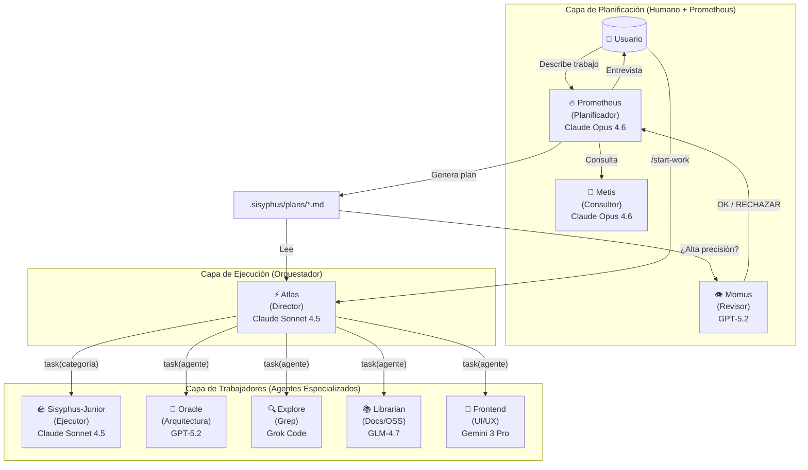
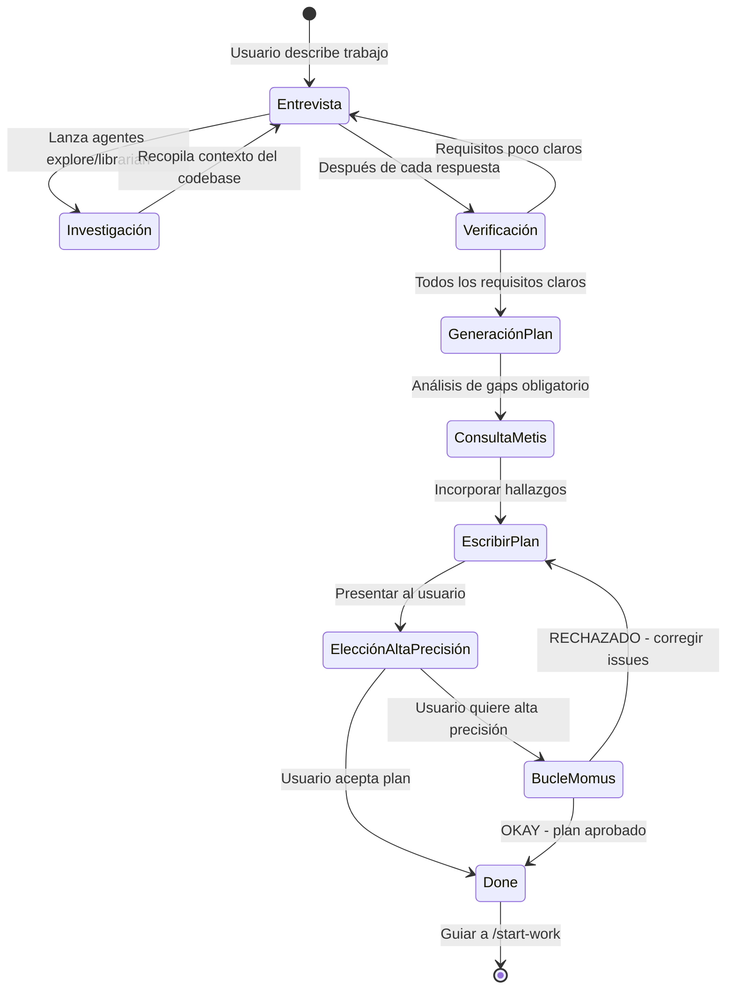

# Orquestación de Agentes con Hooks: El Patrón que Cambia Todo

¿Te imaginas coordinar un equipo de agentes de IA donde cada uno tiene un rol específico, se comunican entre sí, y responden a eventos en tiempo real? Esto no es ciencia ficción: es la **orquestación basada en hooks**, el patrón arquitectónico que está transformando cómo construimos sistemas multi-agente.

En este artículo, exploraremos en profundidad **oh-my-opencode**, el framework que está revolucionando la orquestación de agentes con más de 41 hooks de ciclo de vida, 11 agentes especializados y un sistema de categorías semánticas que abstrae completamente los modelos subyacentes.

<!-- truncate -->

## El Problema: La Complejidad Multi-Agente

Cuando trabajamos con múltiples agentes de IA, surgen desafíos únicos:

- **Coordinación**: ¿Cómo haces que tres agentes colaboren sin crear un caos de llamadas?
- **Control**: ¿Cómo limitas qué puede hacer cada agente sin bloquear su utilidad?
- **Observabilidad**: ¿Cómo sabes qué agente hizo qué cosa y cuándo?
- **Extensibilidad**: ¿Cómo añades nuevos comportamientos sin romper lo existente?

> **La realidad**: Sin un patrón claro, los sistemas multi-agente se convierten en espagueti inmantenible.

### Síntomas de una Mala Arquitectura

Los signos de que tu sistema necesita orquestación:

1. **Lógica duplicada**: El mismo código de validación en 5 lugares diferentes
2. **Debugging imposible**: No sabes quién modificó qué dato
3. **Miedos a cambios**: Añadir una feature simple rompe tres cosas
4. **Timeouts y race conditions**: Agentes pisándose entre sí

---

## Caso de Estudio: oh-my-opencode

Antes de profundizar en la teoría, veamos un framework real que implementa estos patrones a escala de producción.

[**oh-my-opencode**](https://github.com/code-yeongyu/oh-my-opencode) es un plugin para OpenCode que implementa orquestación multi-agente con:

- **11 agentes especializados** (Sisyphus, Hephaestus, Atlas, Prometheus, Oracle, Librarian, Explore, etc.)
- **41 hooks de ciclo de vida** distribuidos en 7 tipos de eventos
- **Sistema de categorías semánticas** que abstrae los modelos de IA
- **Sistema de tareas con dependencias** y ejecución paralela optimizada

### Arquitectura en Tres Capas

oh-my-opencode implementa una arquitectura de tres capas que separa claramente las responsabilidades:



### Principio Fundamental: Separación de Planificación y Ejecución

La filosofía central de oh-my-opencode es que **la planificación y la ejecución deben estar completamente separadas**:

1. **Prometheus (Planificador)**: Un estratega puro que nunca escribe código. Establece planes perfectos a través de entrevistas y análisis.
2. **Atlas (Orquestador)**: Un director que ejecuta planes. Delega trabajo a agentes especializados y no para hasta completar.

> **¿Por qué esta separación?** Los agentes de IA tradicionales mezclan planificación y ejecución, lo que lleva a contaminación de contexto, desviación de objetivos y "AI slop" (código de baja calidad).

---

## El Sistema de Hooks: El Corazón de la Orquestación

Un **hook** es un punto de extensión en el ciclo de vida de un agente donde puedes inyectar lógica personalizada. oh-my-opencode implementa **41 hooks** distribuidos en **7 tipos de eventos**:

### Tipos de Eventos y Hooks

| Evento | Método Hook | Puede Bloquear | Cantidad |
|--------|-------------|----------------|----------|
| UserPromptSubmit | `chat.message` | Sí | 4 |
| ChatParams | `chat.params` | No | 2 |
| PreToolUse | `tool.execute.before` | Sí | 13 |
| PostToolUse | `tool.execute.after` | No | 18 |
| SessionEvent | `event` | No | 17 |
| MessagesTransform | `experimental.chat.messages.transform` | No | 1 |
| Compaction | `onSummarize` | No | 1 |

### Hooks Bloqueantes (Críticos)

| Hook | Evento | Bloquea Cuando |
|------|--------|----------------|
| auto-slash-command | chat.message | La ejecución del comando falla |
| keyword-detector | chat.message | La inyección de keyword falla |
| prometheus-md-only | tool.execute.before | Escritura fuera de `.sisyphus/*.md` |
| subagent-question-blocker | tool.execute.before | Herramienta de pregunta en subagente |
| write-existing-file-guard | tool.execute.before | Escritura a archivo existente |

### Orden de Ejecución

Los hooks se ejecutan en un orden específico para garantizar comportamiento predecible:

```
UserPromptSubmit: keywordDetector → claudeCodeHooks → autoSlashCommand → startWork

PreToolUse: subagentQuestionBlocker → questionLabelTruncator → claudeCodeHooks
            → nonInteractiveEnv → commentChecker → directoryAgentsInjector
            → directoryReadmeInjector → rulesInjector → prometheusMdOnly
            → sisyphusJuniorNotepad → writeExistingFileGuard → atlasHook

PostToolUse: claudeCodeHooks → toolOutputTruncator → contextWindowMonitor
             → commentChecker → directoryAgentsInjector → directoryReadmeInjector
             → rulesInjector → emptyTaskResponseDetector → agentUsageReminder
             → interactiveBashSession → editErrorRecovery → delegateTaskRetry
             → atlasHook → taskResumeInfo → taskReminder
```

### Hook Estrella: Todo Continuation Enforcer

El hook más importante de oh-my-opencode es el **Todo Continuation Enforcer**, conocido como el "mecanismo de la piedra" (boulder mechanism):

```typescript
// El sistema recuerda TODOS los TODOs pendientes
// Y FUERZA al agente a completarlos antes de responder

[RECORDATORIO DEL SISTEMA - CONTINUACIÓN DE TODO]

¡Tienes TODOs incompletos! Completa TODOS antes de responder:
- [ ] Implementar servicio de usuario ← EN PROGRESO
- [ ] Añadir validación
- [ ] Escribir tests

NO RESPONDAS hasta que todos los TODOs estén marcados como completados.
```

Este mecanismo es tan central que el agente principal se llama **Sisyphus**, en referencia a la mitología griega donde Sísifo fue condenado a empujar una piedra colina arriba por la eternidad. El agente nunca deja de "empujar la piedra" hasta que el trabajo está completo.

---

## El Sistema de Categorías: Abstracción de Modelos

Una de las innovaciones más importantes de oh-my-opencode es el **sistema de categorías semánticas** que abstrae completamente los modelos de IA subyacentes.

### El Problema con los Nombres de Modelos

```typescript
// ANTIGUO: El nombre del modelo crea sesgo distribucional
task(agent="gpt-5.2", prompt="...")  // El modelo conoce sus limitaciones
task(agent="claude-opus-4.6", prompt="...")  // Diferente auto-percepción
```

### La Solución: Categorías Semánticas

```typescript
// NUEVO: La categoría describe INTENCIÓN, no implementación
task(category="ultrabrain", prompt="...")     // "Piensa estratégicamente"
task(category="visual-engineering", prompt="...")  // "Diseña bellamente"
task(category="quick", prompt="...")          // "Solo hazlo rápido"
```

### Categorías Integradas

| Categoría | Modelo | Cuándo Usar |
|-----------|--------|-------------|
| `visual-engineering` | Gemini 3 Pro | Frontend, UI/UX, diseño, estilos, animaciones |
| `ultrabrain` | GPT-5.2 Codex (xhigh) | Razonamiento lógico profundo, decisiones arquitectónicas complejas |
| `artistry` | Gemini 3 Pro (max) | Tareas altamente creativas/artísticas, ideas novedosas |
| `quick` | Claude Haiku 4.5 | Tareas triviales - cambios de un solo archivo, correcciones de typos |
| `unspecified-low` | Claude Sonnet 4.5 | Tareas que no encajan en otras categorías, bajo esfuerzo |
| `unspecified-high` | Claude Opus 4.5 (max) | Tareas que no encajan en otras categorías, alto esfuerzo |
| `writing` | Gemini 3 Flash | Documentación, prosa, escritura técnica |

### Categorías Personalizadas

Puedes definir tus propias categorías en la configuración:

```json
// .opencode/oh-my-opencode.json
{
  "categories": {
    "unity-game-dev": {
      "model": "openai/gpt-5.2",
      "temperature": 0.3,
      "prompt_append": "Eres un experto en desarrollo de juegos Unity..."
    },
    "data-science": {
      "model": "anthropic/claude-opus-4-6",
      "temperature": 0.1,
      "prompt_append": "Eres un científico de datos experto en ML..."
    }
  }
}
```

---

## El Sistema de Tareas con Dependencias

oh-my-opencode implementa un sistema de tareas con tracking de dependencias y optimización de ejecución paralela:

### Schema de Tarea

```typescript
interface Task {
  id: string              // T-{uuid}
  subject: string         // Imperativo: "Ejecutar tests"
  description: string
  status: "pending" | "in_progress" | "completed" | "deleted"
  activeForm?: string     // Presente continuo: "Ejecutando tests"
  blocks: string[]        // Tareas que esta bloquea
  blockedBy: string[]     // Tareas que bloquean esta
  owner?: string          // Nombre del agente
  metadata?: Record<string, unknown>
  threadID: string        // ID de sesión (auto-set)
}
```

### Ejecución Paralela con Dependencias

```
[Build Frontend]    ──┐
                      ├──→ [Tests de Integración] ──→ [Deploy]
[Build Backend]     ──┘
```

- Las tareas con `blockedBy` vacío se ejecutan en paralelo
- Las tareas dependientes esperan hasta que sus bloqueadores completen

### Ejemplo de Flujo de Trabajo

```typescript
// Crear tareas con dependencias
TaskCreate({ subject: "Construir frontend" })                    // T-001
TaskCreate({ subject: "Construir backend" })                     // T-002
TaskCreate({
  subject: "Ejecutar tests de integración",
  blockedBy: ["T-001", "T-002"]                                  // T-003
})
TaskCreate({
  subject: "Desplegar a producción",
  blockedBy: ["T-003"]                                           // T-004
})

// El sistema automáticamente:
// 1. Ejecuta T-001 y T-002 en paralelo
// 2. Espera a que ambos completen
// 3. Ejecuta T-003
// 4. Cuando T-003 completa, ejecuta T-004
```

---

## El Sistema de Skills: Instrucciones Especializadas

Las **skills** son instrucciones especializadas que se prepended a los prompts de subagentes:

### Uso de Skills

```typescript
// Combinación de Categoría + Skill
task(
  category="visual-engineering",
  load_skills=["frontend-ui-ux"],  // Añade expertise UI/UX
  prompt="..."
)

task(
  category="general",
  load_skills=["playwright"],  // Añade expertise de automatización de browser
  prompt="..."
)
```

### Ejemplo: Skill de Git Master

oh-my-opencode incluye una skill de **Git Master** que combina tres especializaciones:

1. **Arquitecto de Commits**: Commits atómicos, orden de dependencias, detección de estilo
2. **Cirujano de Rebase**: Reescritura de historial, resolución de conflictos, limpieza de branches
3. **Arqueólogo de Historial**: Encontrar cuándo/dónde se introdujeron cambios específicos

```typescript
// Regla核心: MÚLTIPLES COMMITS POR DEFECTO
// UN COMMIT = FALLO AUTOMÁTICO

"HARD RULE:
3+ archivos cambiados -> DEBEN ser 2+ commits
5+ archivos cambiados -> DEBEN ser 3+ commits
10+ archivos cambiados -> DEBEN ser 5+ commits"
```

---

## Arquitectura de Streaming: 1 Issue = 1 Background Task

Uno de los patrones más poderosos de oh-my-opencode es la **arquitectura de streaming** para procesamiento paralelo:

### El Problema

El enfoque tradicional procesa todo en batch:

```
"Procesando 50 issues... (espera 5 min) ...aquí están todos los resultados"
```

El usuario no ve nada durante el procesamiento.

### La Solución: Streaming en Tiempo Real

```typescript
// CORRECTO: Lanzar como background tasks, streamear resultados
const taskIds = []

// FASE 1: Lanzar 1 background task por issue
for (let i = 0; i < allIssues.length; i++) {
  const issue = allIssues[i]
  const category = getCategory(i)

  const taskId = await task(
    category=category,
    run_in_background=true,  // ← CRÍTICO: Cada issue es independiente
    prompt=`Analizar issue #${issue.number}...`
  )
  taskIds.push({ issue: issue.number, taskId })
  console.log(`🚀 Lanzada tarea para Issue #${issue.number}`)
}

// FASE 2: Streamear resultados según completan
while (completed.size < taskIds.length) {
  for (const { issue, taskId } of taskIds) {
    if (completed.has(issue)) continue

    const result = await background_output(task_id=taskId, block=false)

    if (result && result.output) {
      // STREAMING: Reportar inmediatamente según cada tarea completa
      reportRealtime(result.output)
      completed.add(issue)
      console.log(`✅ Issue #${issue} análisis completo`)
    }
  }
}
```

### Por Qué Streaming Importa

- **El usuario ve progreso inmediatamente** - no hay 5 minutos de silencio
- **Issues críticos se detectan temprano** - se puede actuar mientras otros procesan
- **Transparente** - el usuario sabe qué está pasando en tiempo real
- **Fail-fast** - si algo rompe, ya tenemos resultados parciales

---

## Flujo de Trabajo Completo: Prometheus → Atlas → Junior

Veamos cómo funciona el flujo completo de orquestación:

### Fase 1: Entrevista y Planificación

Prometheus inicia en **modo entrevista** por defecto:



### Fase 2: Ejecución

Cuando el usuario ejecuta `/start-work`:

1. **Gestión de Estado**: Crea/lee el archivo `boulder.json` para trackear el plan actual y session ID
2. **Ejecución de Tareas**: Atlas lee el plan y procesa los TODOs uno por uno
3. **Delegación**: El trabajo de UI se delega al agente Frontend, lógica compleja a Oracle
4. **Continuidad**: Incluso si la sesión se interrumpe, el trabajo continúa en la siguiente sesión vía `boulder.json`

### Acumulación de Sabiduría

El poder de la orquestación es el **aprendizaje acumulativo**. Después de cada tarea:

1. Extraer learnings de la respuesta del subagente
2. Categorizar en: Convenciones, Éxitos, Fallos, Gotchas, Comandos
3. Pasar adelante a TODOS los subagentes subsecuentes

**Sistema de Notepads:**

```
.sisyphus/notepads/{nombre-plan}/
├── learnings.md      # Patrones, convenciones, enfoques exitosos
├── decisions.md      # Decisiones arquitectónicas y racionales
├── issues.md         # Problemas, bloqueadores, gotchas encontrados
├── verification.md   # Resultados de tests, outcomes de validación
└── problems.md       # Issues no resueltos, deuda técnica
```

---

## Cómo Aplicar Estos Patrones a Tus Proyectos

Ahora que entendemos la arquitectura de oh-my-opencode, veamos cómo aplicar estos patrones a tus propios proyectos:

### 1. Implementa un Sistema de Hooks

```typescript
// Definición básica de hook
interface HookContext {
  agentId: string
  toolName: string
  params: Record<string, any>
  result?: any
}

type HookHandler = (ctx: HookContext) => Promise<boolean | void>

class HookSystem {
  private hooks: Map<string, HookHandler[]> = new Map()

  register(event: string, handler: HookHandler) {
    if (!this.hooks.has(event)) {
      this.hooks.set(event, [])
    }
    this.hooks.get(event)!.push(handler)
  }

  async execute(event: string, ctx: HookContext): Promise<boolean> {
    const handlers = this.hooks.get(event) || []
    for (const handler of handlers) {
      const result = await handler(ctx)
      if (result === false) return false // Bloquear ejecución
    }
    return true
  }
}

// Uso
const hooks = new HookSystem()

// Pre-tool hook: Validación
hooks.register('pre-tool', async (ctx) => {
  if (!isAuthorized(ctx.agentId, ctx.toolName)) {
    throw new Error('No autorizado')
  }
  return true
})

// Post-tool hook: Métricas
hooks.register('post-tool', async (ctx) => {
  await metrics.record({
    agent: ctx.agentId,
    tool: ctx.toolName,
    timestamp: Date.now()
  })
})
```

### 2. Implementa Categorías Semánticas

```typescript
interface CategoryConfig {
  model: string
  temperature: number
  promptAppend?: string
}

const categories: Record<string, CategoryConfig> = {
  'quick': {
    model: 'claude-haiku-4-5',
    temperature: 0.1
  },
  'deep-thinking': {
    model: 'claude-opus-4-6',
    temperature: 0.1,
    promptAppend: 'Tómate tu tiempo para pensar profundamente...'
  },
  'creative': {
    model: 'gemini-3-pro',
    temperature: 0.7,
    promptAppend: 'Sé creativo y explora ideas no convencionales...'
  }
}

function delegateTask(category: string, prompt: string) {
  const config = categories[category] || categories['quick']
  return callModel({
    model: config.model,
    temperature: config.temperature,
    prompt: config.promptAppend ? `${config.promptAppend}\n\n${prompt}` : prompt
  })
}
```

### 3. Implementa Continuidad de Sesión

```typescript
// Boulder state para continuidad
interface BoulderState {
  activePlan: string
  sessionIds: string[]
  startedAt: string
  planName: string
}

class SessionContinuity {
  private statePath = '.sisyphus/boulder.json'

  loadState(): BoulderState | null {
    try {
      return JSON.parse(fs.readFileSync(this.statePath, 'utf-8'))
    } catch {
      return null
    }
  }

  saveState(state: BoulderState) {
    fs.writeFileSync(this.statePath, JSON.stringify(state, null, 2))
  }

  resume(): { resumed: boolean; progress: string } {
    const state = this.loadState()
    if (!state) {
      return { resumed: false, progress: 'Nueva sesión' }
    }

    const plan = fs.readFileSync(state.activePlan, 'utf-8')
    const completed = (plan.match(/- \[x\]/g) || []).length
    const total = (plan.match(/- \[[ x]\]/g) || []).length

    return {
      resumed: true,
      progress: `Retomando '${state.planName}' - ${completed}/${total} tareas completadas`
    }
  }
}
```

### 4. Implementa el Mecanismo de TODO Continuation

```typescript
class TodoContinuationEnforcer {
  private pendingTodos: Set<string> = new Set()

  register(todoId: string) {
    this.pendingTodos.add(todoId)
  }

  complete(todoId: string) {
    this.pendingTodos.delete(todoId)
  }

  generateReminder(): string | null {
    if (this.pendingTodos.size === 0) return null

    const todos = Array.from(this.pendingTodos)
    return `
[RECORDATORIO DEL SISTEMA - CONTINUACIÓN DE TODO]

¡Tienes ${todos.length} TODOs incompletos! Completa TODOS antes de responder:
${todos.map(t => `- [ ] ${t}`).join('\n')}

NO RESPONDAS hasta que todos los TODOs estén marcados como completados.
`
  }
}
```

---

## Filosofía: El Manifiesto Ultrawork

oh-my-opencode está construido sobre principios filosóficos claros, documentados en el **Ultrawork Manifesto**:

### La Intervención Humana es una Señal de Fallo

> **HUMANO EN EL LOOP = CUELLO DE BOTELLA**

Cuando te encuentras:

- Arreglando el código a medias del AI
- Corrigiendo manualmente errores obvios
- Guiando al agente paso a paso
- Aclarando repetidamente los mismos requisitos

...eso no es "colaboración humano-AI". Eso es el AI fallando en hacer su trabajo.

### Código Indistinguible

> **Objetivo: El código escrito por el agente debe ser indistinguible del código escrito por un ingeniero senior.**

No "código generado por AI que necesita cleanup". No "un buen punto de partida". El código real, final, listo para producción.

### Predecible, Continuo, Delegable

El agente ideal debe trabajar como un compilador: documento markdown entra, código funcional sale.

- **Predecible**: Dados los mismos inputs, el output debe ser consistente
- **Continuo**: El trabajo debe sobrevivir interrupciones
- **Delegable**: Deberías poder asignar una tarea y confiar que se manejará

---

## Conclusión: El Poder de la Orquestación

La orquestación basada en hooks no es solo un patrón técnico: es una **filosofía de diseño** que promueve:

- **Modularidad**: Cada pieza hace una cosa bien
- **Extensibilidad**: Añade comportamiento sin tocar código existente
- **Observabilidad**: Cada acción es trazable
- **Resiliencia**: Fallos aislados, recuperación graceful

oh-my-opencode demuestra que estos patrones escalan a producción con:

- 41 hooks coordinando comportamiento
- 11 agentes especializados
- Sistema de categorías que abstrae modelos
- Continuidad de sesión que sobrevive crashes

### Siguientes Pasos

1. **Explora oh-my-opencode**: [github.com/code-yeongyu/oh-my-opencode](https://github.com/code-yeongyu/oh-my-opencode)
2. **Lee la documentación**: [docs/guide/understanding-orchestration-system.md](https://github.com/code-yeongyu/oh-my-opencode/blob/dev/docs/guide/understanding-orchestration-system.md)
3. **Implementa hooks básicos**: Empieza con pre-tool validation y post-tool logging
4. **Experimenta con categorías**: Define tus propias categorías para tu dominio

---

## Recursos Adicionales

- [oh-my-opencode en GitHub](https://github.com/code-yeongyu/oh-my-opencode)
- [Guía de Orquestación](https://github.com/code-yeongyu/oh-my-opencode/blob/dev/docs/orchestration-guide.md)
- [Ultrawork Manifesto](https://github.com/code-yeongyu/oh-my-opencode/blob/dev/docs/ultrawork-manifesto.md)
- [Sistema de Tareas](https://github.com/code-yeongyu/oh-my-opencode/blob/dev/docs/task-system.md)
- [Discord Community](https://discord.gg/PUwSMR9XNk)

---

**¿Usas hooks en tus sistemas de IA?** Cuéntanos tu experiencia en los comentarios o en redes sociales. La orquestación efectiva es clave para el futuro de los sistemas de IA, y cada insight cuenta.
