# Fundamentos y Core Four: La Arquitectura de Claude Code

## Introducción: Cuatro Piezas, Un Sistema Composicional

En 2025, el desarrollo asistido por IA ha evolucionado más allá de los simples prompts en una interfaz de chat. Claude Code y herramientas similares ahora ofrecen múltiples mecanismos de extensión: **Skills**, **Slash Commands**, **MCP Servers** y **Sub-agents**. Entender cuándo usar cada uno no es solo una cuestión de preferencia personal, sino de arquitectura fundamental.

El error más común que cometen los desarrolladores al adoptar estas herramientas es tratarlas como alternativas intercambiables. Convertir todos los slash commands en skills, anidar sub-agents innecesariamente, o crear MCPs cuando un simple prompt bastaría. La realidad es que estas cuatro piezas **no son substitutos**, son **composicionales**: cada una resuelve un problema específico y juntas forman un sistema coherente para el desarrollo agentico.

Esta guía te ayudará a comprender cuándo usar cada mecanismo, cómo componen entre sí, y qué patrones de diseño aplicar para evitar la sobre-ingeniería. El objetivo no es maximizar el uso de todas las capacidades avanzadas, sino elegir la herramienta correcta para cada trabajo y mantener la arquitectura simple y mantenible.

## Fundamentos: La Arquitectura de Claude Code

Antes de comparar Skills, MCP, Sub-agents y Slash Commands, es crucial entender los **Core Four**: los cuatro elementos fundamentales que componen cualquier agente en Claude Code.

### Los Core Four

1. **Contexto**: La memoria de trabajo del agente. Incluye CLAUDE.md (instrucciones de proyecto), archivos leídos, conversación actual, y estado acumulado.

2. **Modelo**: El LLM subyacente (Claude Opus 4.5, Sonnet 4.5, Haiku 4.5). Determina capacidad de razonamiento, velocidad, y costo.

3. **Prompt**: La unidad fundamental de instrucción. Define qué debe hacer el agente, cómo debe pensarlo, y qué formato seguir.

4. **Herramientas**: Las capacidades que el agente puede invocar (Read, Write, Bash, Grep, MCP servers personalizados, etc.).

```mermaid
graph TB
    A["📚 Contexto<br/>(Memoria de trabajo)"]
    B["🧠 Modelo<br/>(Claude Opus/Sonnet/Haiku)"]
    C["💬 Prompt<br/>(Instrucción fundamental)"]
    D["🔧 Herramientas<br/>(Read, Write, Bash, MCP...)"]

    E["Agente Coherente"]

    A --> E
    B --> E
    C --> E
    D --> E

    style A fill:#0288d1,stroke:#fff,stroke-width:2px,color:#fff
    style B fill:#7b1fa2,stroke:#fff,stroke-width:2px,color:#fff
    style C fill:#2e7d32,stroke:#fff,stroke-width:2px,color:#fff
    style D fill:#e65100,stroke:#fff,stroke-width:2px,color:#fff
    style E fill:#f57c00,stroke:#fff,stroke-width:2px,color:#fff
```

★ Insight ─────────────────────────────────────
Los Core Four are **elementos independientes** que se combinan para formar un agente funcional. Modificar cualquiera de ellos (cambiar modelo, mejorar prompt, agregar herramientas) afecta el comportamiento total. Las cuatro extensiones que veremos (Skills, Slash Commands, MCP, Sub-agents) son simplemente formas de modificar estos elementos de manera composicional.
─────────────────────────────────────────────────

### El Prompt Sigue Siendo Fundamental

Aquí está la verdad incómoda que muchos desarrolladores olvidan al emocionarse con Skills y Sub-agents: **el prompt es la unidad fundamental de todo**. No importa cuán sofisticada sea tu arquitectura de skills o cuántos MCP servers tengas configurados, todo se reduce a qué le estás diciendo al modelo que haga.

Esto significa:

- **Empezar con prompts simples**: Antes de crear un skill reutilizable, afina el prompt conversacionalmente.
- **Prompt engineering primero**: La mayoría de problemas se resuelven con mejor redacción del prompt, no con más abstracciones.
- **No entregar control prematuramente**: Subir a skills o sub-agents muy rápido puede oscurecer el reasoning crítico.

### Cómo Se Componen Estas Piezas

Los cuatro mecanismos (Skills, Slash Commands, MCP, Sub-agents) son formas de **modificar o extender los Core Four**:

- **Skills** modifican el contexto y el prompt automáticamente cuando el modelo detecta relevancia
- **Slash Commands** invocan prompts predefinidos manualmente con argumentos opcionales
- **MCP Servers** extienden las herramientas disponibles para conectar sistemas externos
- **Sub-agents** crean instancias separadas con su propio contexto, modelo, prompt y herramientas

La clave del diseño arquitectónico efectivo es entender qué estás modificando y por qué.

```mermaid
graph TB
    subgraph CoreFour["Core Four Fundamental"]
        CTX["📚 Contexto"]
        MODEL["🧠 Modelo"]
        PROMPT["💬 Prompt"]
        TOOLS["🔧 Herramientas"]
    end

    subgraph Extensiones["Cuatro Mecanismos de Extensión"]
        SKILL["⚡ Skills<br/>(Contexto + Prompt)"]
        SLASH["⌨️ Slash Commands<br/>(Prompt + Manual)"]
        MCP["🔌 MCP Servers<br/>(Herramientas)"]
        SUBAGENT["🤖 Sub-agents<br/>(Todos separados)"]
    end

    CTX -.->|modifica| SKILL
    PROMPT -.->|modifica| SKILL

    PROMPT -.->|invoca| SLASH

    TOOLS -.->|extiende| MCP

    CTX -.->|aislado| SUBAGENT
    MODEL -.->|aislado| SUBAGENT
    PROMPT -.->|aislado| SUBAGENT
    TOOLS -.->|aislado| SUBAGENT

    style CoreFour fill:#37474f,stroke:#fff,stroke-width:2px,color:#fff
    style Extensiones fill:#455a64,stroke:#fff,stroke-width:2px,color:#fff
    style SKILL fill:#2e7d32,stroke:#fff,stroke-width:2px,color:#fff
    style SLASH fill:#1976d2,stroke:#fff,stroke-width:2px,color:#fff
    style MCP fill:#9c27b0,stroke:#fff,stroke-width:2px,color:#fff
    style SUBAGENT fill:#f57c00,stroke:#fff,stroke-width:2px,color:#fff
```

★ Insight ─────────────────────────────────────
Cada mecanismo de extensión **modifica un subconjunto diferente** de los Core Four. Un skill modifica contexto y prompt (automáticamente), un slash command solo invoca un prompt (manualmente), MCP extiende herramientas, y los sub-agents crean una **copia completamente aislada** de todos los elementos. Esto es la razón por la cual no son intercambiables - cada uno resuelve un problema diferente.
─────────────────────────────────────────────────
