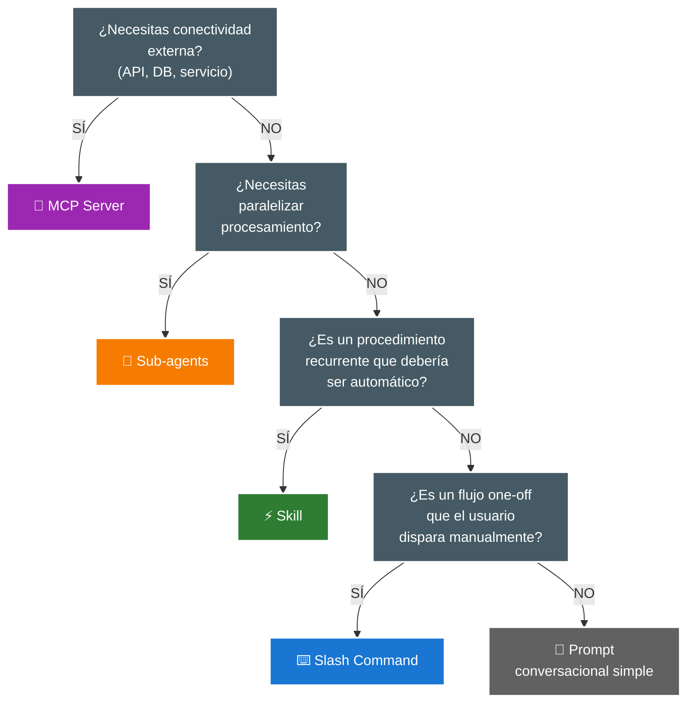

## Comparativa: Cuatro Tipos de Extensión

### Skills: Automatización Modelo-Invocada

**Definición**: Bloques de contexto y prompt reutilizables que Claude activa autónomamente cuando detecta relevancia.

**Características clave**:
- **Invocación**: El modelo decide cuándo activarlos basándose en la descripción
- **Ubicación**: `~/.claude/skills/`, `.claude/skills/`, o dentro de plugins
- **Estructura**: Directorio con `SKILL.md` (required) + archivos opcionales de soporte
- **Ámbito**: Contexto inyectado en la conversación actual

**Cuándo usarlos**:
- Procedimientos organizacionales que se aplican recurrentemente
- Directrices de marca o estilo que deben seguirse automáticamente
- Fórmulas o cálculos especializados que se usan frecuentemente
- Extracción de datos de formatos específicos (PDFs, logs, etc.)

**Ejemplo de SKILL.md**:
```yaml
---
description: Genera mensajes de commit siguiendo Conventional Commits con emojis según tipo
---

# Commit Message Skill

Cuando el usuario solicite crear un commit, genera el mensaje siguiendo esta estructura:

1. **Tipo con emoji**:
   - feat: ✨
   - fix: 🐛
   - docs: 📝
   - style: 💄
   - refactor: ♻️

2. **Formato**: `tipo(scope): descripción`

3. **Cuerpo** (opcional): Explicación de cambios complejos

Ejemplo:
```
✨ feat(auth): agregar autenticación con OAuth

Implementa flujo de OAuth 2.0 con Google y GitHub.
Incluye refresh tokens y manejo de expiración.
```
```

**Anti-patrón común**: Convertir todos los slash commands en skills. Si es un flujo que el usuario dispara manualmente y no se repite automáticamente, probablemente debería quedarse como slash command.

### Slash Commands: Control Usuario-Invocado

**Definición**: Comandos explícitos que el usuario ejecuta manualmente, con soporte para argumentos.

**Características clave**:
- **Invocación**: Manual, por el usuario escribiendo `/command`
- **Ubicación**: Definidos en settings de Claude Code
- **Estructura**: JSON con nombre, descripción, y prompt
- **Ámbito**: Ejecutan en el contexto de la conversación actual

**Cuándo usarlos**:
- Flujos one-off que requieren disparo manual
- Workflows específicos que el usuario controla explícitamente
- Acciones con parámetros variables (paths, nombres, valores)
- Tareas que están en fase de experimentación antes de automatizarse

**Ejemplo de configuración**:
```json
{
  "commands": [
    {
      "name": "review-pr",
      "description": "Analiza los cambios de un PR y genera comentarios de revisión",
      "prompt": "Revisa los cambios del PR actual:\n1. Lee git diff\n2. Identifica issues de código, seguridad, o performance\n3. Genera comentarios constructivos en formato markdown\n4. Sugiere mejoras sin ser pedante"
    }
  ]
}
```

**Escalada natural**: Si un slash command se usa recurrentemente y siempre en el mismo contexto, considera convertirlo en skill para automatización.

### MCP Servers: Conectividad Externa

**Definición**: Model Context Protocol servers que actúan como adaptadores universales a sistemas externos.

**Características clave**:
- **Invocación**: El modelo los usa como herramientas cuando necesita capacidades externas
- **Ubicación**: Configurados en settings, pueden ser locales o remotos
- **Estructura**: Ejecutables que exponen resources, tools, y prompts según el protocolo MCP
- **Ámbito**: Extienden las herramientas disponibles globalmente

**Cuándo usarlos**:
- Integración con servicios externos (Google Drive, Slack, GitHub)
- Acceso a bases de datos o APIs propias
- Herramientas del sistema que necesitas invocar programáticamente
- Cualquier funcionalidad que no viene incluida en Claude Code por defecto

**Ejemplos de uso común**:
- MCP Google Drive: Leer/escribir documentos en Drive
- MCP GitHub: Crear issues, comentar PRs, actualizar labels
- MCP Slack: Enviar mensajes, leer canales
- MCP Filesystem: Acceso extendido a filesystem con permisos específicos
- MCP Database: Ejecutar queries en PostgreSQL, MySQL, etc.

**Composición con Skills**: Un skill puede invocar tools de un MCP server. Ejemplo: un skill de "extracción de datos de PDF" puede usar un MCP server que maneja lectores especializados de PDF.

### Sub-agents: Especialización y Paralelismo

**Definición**: Instancias independientes de Claude con su propio contexto, prompt de sistema, y restricción de herramientas.

**Características clave**:
- **Invocación**: Explícitamente mediante llamadas a sub-agent
- **Ubicación**: Definidos en `.claude/agents/`
- **Estructura**: Archivo con system prompt y configuración de tools
- **Ámbito**: Contexto completamente aislado, no ven la conversación principal

**Cuándo usarlos**:
- **Paralelización**: Procesar múltiples items concurrentemente (analizar 10 archivos en paralelo)
- **Especialización**: Tareas que requieren contexto diferenciado (un agente solo para testing, otro solo para docs)
- **Restricción de herramientas**: Limitar deliberadamente qué puede hacer el agente (solo lectura, sin bash, etc.)

**Ejemplo de definición**:
```yaml
---
name: test-specialist
description: Agente especializado en escribir tests unitarios
---

# System Prompt

Eres un especialista en testing. Solo te enfocas en escribir tests unitarios con alta cobertura.

## Reglas:
- Usa Jest/Vitest según el proyecto
- Cubre edge cases y error handling
- No modifiques código de producción, solo tests
- Genera mocks cuando sea necesario

## Tools permitidas:
- Read: para leer código fuente
- Write: solo para archivos *.test.js o *.spec.js
- Grep: para encontrar patrones de testing
```

**Regla de oro**: Si necesitas paralelizar, usa sub-agents. Si solo necesitas contexto especializado sin paralelismo, considera si un skill con instrucciones claras bastaría.

### Tabla Comparativa

| Característica | Skills | Slash Commands | MCP Servers | Sub-agents |
|----------------|--------|----------------|-------------|------------|
| **Invocación** | Automática (modelo) | Manual (usuario) | Automática (tool) | Explícita (llamada) |
| **Cuándo se activa** | Contexto relevante | Escribir `/cmd` | Necesidad externa | Llamada directa |
| **Contexto** | ✅ Compartido | ✅ Compartido | ❌ N/A | 🔒 Aislado |
| **Reusabilidad** | ⭐ Alta | 🆗 Media | 🔥 Muy alta | 🆗 Media |
| **Paralelización** | ❌ No | ❌ No | ❌ No | ✅ Sí (Core use case) |
| **Complejidad setup**| 🆗 Media | ⚡ Baja | ⚙️ Alta | 🆗 Media |

---

**Siguiente paso:** [Patrones de Diseño: Componiendo con elegancia](./03-patrones-de-diseno.md)

## Matriz de Decisión: Cuándo Usar Cada Uno

### Árbol de Decisión



### Ejemplos Concretos por Camino

**Caso: Generar mensajes de commit**
- **Primera vez**: Prompt conversacional ("genera un commit message para estos cambios")
- **Se repite frecuentemente**: Slash command `/commit-msg` para control manual
- **Se usa en todos los commits**: Skill que se activa automáticamente al detectar `git commit`

**Caso: Enviar notificaciones a Slack**
- **Solución**: MCP Server de Slack
- **Por qué no un skill**: Requiere integración externa, no solo contexto
- **Por qué no un sub-agent**: No necesitas aislamiento ni paralelización

**Caso: Analizar 50 archivos de log para encontrar patrones**
- **Solución**: Sub-agents (uno por cada 5 archivos, por ejemplo)
- **Por qué no un skill**: Requiere paralelización, un skill ejecutaría secuencialmente
- **Por qué no un slash command**: Es trabajo computacional, no un flujo manual simple

**Caso: Aplicar directrices de marca en documentación**
- **Solución**: Skill con las reglas de estilo
- **Por qué no un slash command**: Debería aplicarse automáticamente, no manualmente
- **Por qué no un MCP**: No requiere conectividad externa
- **Por qué no un sub-agent**: No requiere paralelización ni contexto aislado

### Anti-patrones Comunes

**❌ Skill-itis**: Convertir todo en skills
- Síntoma: Tienes 30+ skills y no estás seguro cuáles se activan
- Problema: Descripciones vagas que causan activaciones incorrectas
- Solución: Empezar con prompts, escalar solo lo recurrente

**❌ MCP para todo**: Crear MCPs cuando no hay integración externa
- Síntoma: MCP que solo lee/escribe archivos locales
- Problema: Overhead innecesario, ya tienes esas herramientas
- Solución: Usar tools nativas de Claude Code primero

**❌ Sub-agents anidados**: Crear cadenas largas de sub-agents llamando sub-agents
- Síntoma: "Subagent A llama a Subagent B que llama a Subagent C"
- Problema: Debugging imposible, fiabilidad baja, contexto fragmentado
- Solución: Máximo 2 niveles de profundidad, preferir composición horizontal

**❌ Slash commands para todo**: Crear 50 comandos para cada tarea
- Síntoma: Lista de `/` que parece una aplicación CLI completa
- Problema: Carga cognitiva alta, difícil recordar todos
- Solución: Solo flujos verdaderamente recurrentes y manuales
