## Patrones de Composición

Las cuatro piezas no existen en aislamiento. Los patrones más poderosos surgen de combinarlas inteligentemente.

### Patrón 1: Skill + MCP (Automatización con Conectividad)

**Caso de uso**: Extraer datos de documentos en Google Drive y generar reportes

```yaml
# .claude/skills/drive-report-extractor/SKILL.md
---
description: Extrae datos de hojas de cálculo en Drive y genera reportes en markdown
---

Cuando el usuario pida "generar reporte de ventas" o similar:

1. Usa el MCP de Google Drive para listar archivos en la carpeta "Ventas"
2. Lee las hojas de cálculo del mes actual
3. Extrae métricas clave (total, promedio, top 5 productos)
4. Genera un reporte en markdown con gráficos en ASCII
5. Guarda el reporte en `reports/ventas-YYYY-MM.md`
```

**Por qué funciona**: El skill proporciona el procedimiento automático, el MCP proporciona la conectividad. Claude activa el skill cuando detecta la intención y usa el MCP como herramienta.

```mermaid
sequenceDiagram
    autonumber
    actor Usuario
    participant Claude
    participant Skill
    participant MCP as MCP Google Drive
    participant Drive as Google Drive

    Usuario->>Claude: "Generar reporte de ventas"
    Claude->>Claude: Detecta intención 'reporte de ventas'
    Claude->>Skill: Activa skill automáticamente

    Skill->>MCP: Listar archivos en carpeta 'Ventas'
    MCP->>Drive: Lee carpeta
    Drive-->>MCP: Lista de archivos
    MCP-->>Skill: Archivos JSON

    Skill->>MCP: Descargar hoja de cálculo
    MCP->>Drive: Obtiene contenido
    Drive-->>MCP: Datos de la hoja
    MCP-->>Skill: Datos estructurados

    Skill->>Skill: Procesa y extrae métricas
    Skill->>Claude: Datos listos para reportar

    Claude->>Usuario: Reporte generado ✅
```



★ Insight ─────────────────────────────────────
**Composición Skill + MCP = Automatización potente**. El skill define el "qué y cuándo", el MCP define el "cómo conectar". Docusaurus renderizará este diagrama automáticamente - la sintaxis Mermaid es nativa en Docusaurus 3.
─────────────────────────────────────────────────

### Patrón 2: Prompt → Slash Command → Skill (Escalada Gradual)

**Evolución de una funcionalidad de testing**:

**Fase 1: Prompt conversacional**
```
Usuario: "Genera tests para este componente React"
Claude: [Analiza componente, escribe tests]
```

**Fase 2: Se repite frecuentemente → Slash Command**
```json
{
  "name": "gen-tests",
  "description": "Genera tests unitarios para componente React",
  "prompt": "Lee el componente en {path}, analiza props y state, genera tests con React Testing Library cubriendo rendering, eventos, y edge cases"
}
```

**Fase 3: Es parte del workflow estándar → Skill**
```yaml
---
description: Genera automáticamente tests cuando se crea un componente React nuevo
---

Cuando detectes que se ha creado un archivo .jsx o .tsx nuevo:
1. Analiza el componente
2. Genera archivo de tests correspondiente en __tests__/
3. Cubre rendering básico, props, y eventos
```

**Lección**: No saltar directamente a skills. Dejar que el patrón de uso emerja naturalmente.

```mermaid
timeline
    title Patrón: Escalada Gradual
    section Día 1
        Prompt conversacional: Usuario pregunta en chat
    section Semana 1
        Se repite diariamente: Crear Slash Command
    section Mes 1
        Parte del workflow estándar: Convertir en Skill

    section Métrica
        Conversacional: Manual, único
        Slash Command: Manual, reutilizable
        Skill: Automático, integrado
```



★ Insight ─────────────────────────────────────
**Esta escalada no es aleatoria**. Cada etapa proporciona retroalimentación sobre si el siguiente nivel de abstracción está justificado. Si un prompt conversacional se usa una sola vez, no necesita slash command. Si un slash command se invoca manualmente cada día, merece automatización como skill.
─────────────────────────────────────────────────

### Patrón 3: Sub-agents para Procesamiento Paralelo con Agregación

**Caso de uso**: Analizar codebase grande para identificar vulnerabilidades de seguridad

```javascript
// Llamada desde agente principal
const files = await glob("**/*.js");
const batches = chunk(files, 10); // 10 archivos por sub-agent

const results = await Promise.all(
  batches.map(batch =>
    invokeSubAgent("security-analyzer", { files: batch })
  )
);
```

> **Nota técnica**: `invokeSubAgent` es una función conceptual que representa la capacidad de Claude Code para delegar tareas. La implementación real puede variar según la versión de las herramientas o si estás usando la API de agentes directamente.

// Agregar resultados
const vulnerabilities = results.flat();
generateReport(vulnerabilities);
```

---

**Siguiente paso:** [Casos Prácticos: Implementaciones reales](./04-casos-practicos.md)

**Sub-agent `security-analyzer`**:
```yaml
---
name: security-analyzer
description: Analiza archivos JavaScript buscando vulnerabilidades de seguridad
---

# System Prompt

Analiza los archivos proporcionados buscando:
- SQL injection
- XSS vulnerabilities
- Insecure dependencies
- Hardcoded secrets

Para cada issue encontrado, reporta:
- Archivo y línea
- Tipo de vulnerabilidad
- Severidad (baja/media/alta/crítica)
- Recomendación de fix
```

**Por qué funciona**: Los sub-agents procesan batches en paralelo, el agente principal agrega resultados. Sin paralelización, analizar 1000 archivos sería lentísimo.

```mermaid
graph TB
    MAIN["🎯 Agente Principal"]

    MAIN -->|Divide en batches| BATCH["10 archivos x batch"]
    BATCH --> SUB1["🤖 Sub-agent 1<br/>(Archivos 1-10)"]
    BATCH --> SUB2["🤖 Sub-agent 2<br/>(Archivos 11-20)"]
    BATCH --> SUB3["🤖 Sub-agent 3<br/>(Archivos 21-30)"]
    BATCH --> SUBN["🤖 Sub-agent N<br/>(...)"]

    SUB1 -->|Analiza en paralelo| RESULTS["Resultados"]
    SUB2 -->|Analiza en paralelo| RESULTS
    SUB3 -->|Analiza en paralelo| RESULTS
    SUBN -->|Analiza en paralelo| RESULTS

    RESULTS -->|Agrega| REPORT["📊 Reporte Final<br/>Vulnerabilidades compiladas"]

    style MAIN fill:#f57c00,stroke:#fff,stroke-width:2px,color:#fff
    style BATCH fill:#616161,stroke:#fff,stroke-width:2px,color:#fff
    style SUB1 fill:#f57c00,stroke:#fff,stroke-width:2px,color:#fff
    style SUB2 fill:#f57c00,stroke:#fff,stroke-width:2px,color:#fff
    style SUB3 fill:#f57c00,stroke:#fff,stroke-width:2px,color:#fff
    style SUBN fill:#f57c00,stroke:#fff,stroke-width:2px,color:#fff
    style RESULTS fill:#616161,stroke:#fff,stroke-width:2px,color:#fff
    style REPORT fill:#2e7d32,stroke:#fff,stroke-width:2px,color:#fff
```



★ Insight ─────────────────────────────────────
**Paralelización = Aceleración exponencial**. Si analizas 100 archivos secuencialmente a 2 minutos por agente = 200 minutos. Con 10 sub-agents en paralelo = 20 minutos. Pero cada sub-agent es una instancia completamente aislada, lo que mantiene el contexto manejable y evita contaminación entre batches.
─────────────────────────────────────────────────

### Patrón 4: CLAUDE.md como Contexto Base + Skills como Especialización

**CLAUDE.md (contexto global del proyecto)**:
```markdown
# Proyecto: E-commerce Platform

## Stack
- Frontend: Next.js 14, TypeScript, Tailwind
- Backend: Node.js, Express, PostgreSQL
- Testing: Jest, React Testing Library

## Convenciones
- Todos los componentes en TypeScript
- Tests en `__tests__/` directories
- API routes en `pages/api/`
```

**Skill específico**:
```yaml
---
description: Genera componentes React siguiendo convenciones del proyecto
---

Al crear componentes React nuevos:
1. Usa TypeScript (según CLAUDE.md)
2. Aplica Tailwind para estilos
3. Incluye PropTypes con JSDoc
4. Genera test correspondiente en __tests__/
5. Exporta como named export
```

**Por qué funciona**: CLAUDE.md establece contexto base que todos (skills, sub-agents, conversación principal) comparten. Skills añaden especialización sin repetir contexto global.

### Evitar la Sobre-ingeniería

**Regla del 80/20**: El 80% de tus necesidades se resuelven con prompts conversacionales bien redactados. Solo el 20% requiere skills, sub-agents, o MCPs personalizados.

**Checklist antes de crear abstracciones**:
- ✅ ¿He refinado el prompt conversacionalmente al menos 3 veces?
- ✅ ¿Este patrón se repite al menos 5 veces por semana?
- ✅ ¿La automatización realmente ahorra tiempo vs. invocación manual?
- ✅ ¿La descripción del skill es lo suficientemente específica para activarse correctamente?
- ✅ ¿El sub-agent realmente necesita contexto aislado o paralelización?

Si respondes "no" a alguna, probablemente no necesitas la abstracción todavía.
