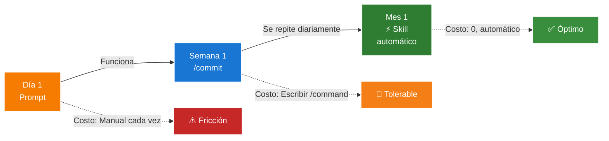

## Ejemplos Prácticos

### Ejemplo 1: Sistema de Commit Messages (Escalada Completa)

**Contexto**: Equipo que quiere estandarizar mensajes de commit siguiendo Conventional Commits.

**Fase 1: Prompt conversacional (día 1)**
```
Usuario: "Genera un commit message para estos cambios"
Claude: [Lee git diff, genera mensaje]
```

**Fase 2: Slash Command (semana 1, se repite diariamente)**
```json
{
  "name": "commit",
  "description": "Genera mensaje de commit siguiendo Conventional Commits",
  "prompt": "Lee git diff, analiza cambios, genera mensaje de commit siguiendo Conventional Commits (feat/fix/docs/etc). Incluye scope si aplica. Descripción concisa en imperativo."
}
```

**Uso**:
```
Usuario: /commit
Claude: [Analiza cambios, genera]
```

**Fase 3: Skill (mes 1, es parte del workflow estándar)**
```yaml
---
description: Genera mensajes de commit automáticamente siguiendo Conventional Commits cuando el usuario mencione crear un commit
---

# Commit Message Skill

Cuando el usuario solicite crear un commit o mencione "commit these changes":

1. Lee `git diff --staged` para ver cambios preparados
2. Analiza la naturaleza de los cambios:
   - feat: nueva funcionalidad
   - fix: corrección de bug
   - docs: cambios en documentación
   - style: formateo, sin cambios de lógica
   - refactor: reestructuración de código
   - test: añadir o corregir tests

3. Genera mensaje con formato:
   ```
   tipo(scope): descripción breve

   [cuerpo opcional explicando el "por qué"]
   ```

4. Usa imperativo ("add" no "added"), primera línea ≤50 caracteres
```

**Reasoning de la escalada**:
- **Prompt → Slash Command**: Se usa diariamente, merece un comando rápido
- **Slash Command → Skill**: Es parte del workflow de todos los commits, la automatización elimina fricción



### Ejemplo 2: Procesamiento de Documentos (Skill + MCP)

**Contexto**: Startup que necesita procesar facturas PDF subidas a Google Drive.

**Solución**: Skill + MCP Google Drive + MCP PDF Parser

> 💡 **Requisito**: Este ejemplo asume que tienes configurados los servidores MCP correspondientes en tu `claude_desktop_config.json` o en los settings de Claude Code.

**MCP Setup** (en settings):
```json
{
  "mcpServers": {
    "google-drive": {
      "command": "npx",
      "args": ["-y", "@modelcontextprotocol/server-gdrive"]
    },
    "pdf-parser": {
      "command": "python",
      "args": ["/path/to/pdf_parser_mcp.py"]
    }
  }
}
```

**Skill**:
```yaml
---
description: Procesa facturas PDF de Google Drive y extrae datos estructurados
---

# Invoice Processor Skill

Cuando el usuario pida "procesar facturas" o "extraer datos de facturas":

1. **Listar archivos**:
   - Usa MCP Google Drive para listar archivos en carpeta "Facturas/Pendientes"
   - Filtra solo PDFs del mes actual

2. **Extraer datos**:
   - Para cada PDF, usa MCP PDF Parser para extraer texto
   - Identifica campos clave:
     * Número de factura
     * Fecha
     * Proveedor
     * Monto total
     * Items y cantidades

3. **Estructurar datos**:
   - Genera JSON con datos extraídos
   - Valida que todos los campos requeridos estén presentes

4. **Guardar resultados**:
   - Escribe JSON a `data/invoices/YYYY-MM.json`
   - Mueve PDFs procesados a carpeta "Facturas/Procesadas" en Drive

5. **Reportar**:
   - Resume cantidad de facturas procesadas
   - Lista cualquier PDF con datos incompletos
```

**Flujo de uso**:
```
Usuario: "Procesa las facturas de este mes"
Claude: [Skill se activa]
         → Llama a MCP Google Drive (listar archivos)
         → Llama a MCP PDF Parser (extraer texto)
         → Genera JSON estructurado
         → Mueve archivos en Drive
         → Reporta resultados
```

```mermaid
graph TB
    subgraph User["Usuario"]
        REQ["Procesa facturas"]
    end

    subgraph System["Sistema Claude Code"]
        SKILL["⚡ Invoice<br/>Processor Skill"]

        subgraph MCPs["MCP Servers"]
            GDRIVE["📁 Google Drive<br/>(listar, mover)"]
            PDF["📄 PDF Parser<br/>(extraer texto)"]
        end

        PROC["Procesar datos<br/>(JSON)"]
    end

    subgraph External["Servicios Externos"]
        DRIVE["Google Drive<br/>(Carpetas: Pendientes,<br/>Procesadas)"]
    end

    REQ -->|Activa| SKILL
    SKILL -->|Usa| GDRIVE
    SKILL -->|Usa| PDF
    SKILL -->|Estructura| PROC

    GDRIVE ↔️ DRIVE
    PDF -.->|Lee de| DRIVE

    PROC -->|Genera| OUTPUT["📊 JSON<br/>estructurado"]

    style REQ fill:#f57c00,stroke:#fff,stroke-width:2px,color:#fff
    style SKILL fill:#2e7d32,stroke:#fff,stroke-width:2px,color:#fff
    style GDRIVE fill:#9c27b0,stroke:#fff,stroke-width:2px,color:#fff
    style PDF fill:#9c27b0,stroke:#fff,stroke-width:2px,color:#fff
    style PROC fill:#1976d2,stroke:#fff,stroke-width:2px,color:#fff
    style DRIVE fill:#616161,stroke:#fff,stroke-width:2px,color:#fff
    style OUTPUT fill:#388e3c,stroke:#fff,stroke-width:2px,color:#fff
```

---

**Siguiente paso:** [Mejores Prácticas y Recursos](./05-mejores-practicas-y-recursos.md)

**Por qué esta arquitectura**:
- **Skill**: Procedimiento recurrente (cada mes), debe ser automático
- **MCP Google Drive**: Conectividad externa a Drive
- **MCP PDF Parser**: Funcionalidad especializada no nativa en Claude Code
- **No sub-agents**: No hay necesidad de paralelización (pocas facturas) ni especialización de contexto

★ Insight ─────────────────────────────────────
Observa cómo **Skill + MCP** permite a Claude "razonar" sobre tareas complejas sin escribir código. El skill describe el flujo conceptualmente, los MCPs manejan la conectividad técnica. Sin this pattern, terminarías escribiendo scripts bash complejos o aplicaciones personalizadas.
─────────────────────────────────────────────────

### Ejemplo 3: Análisis Paralelo de Codebase (Sub-agents)

**Contexto**: Analizar codebase de 500 archivos para generar documentación de API.

**Solución**: Sub-agents para paralelizar procesamiento

**Sub-agent `api-doc-generator`**:
```yaml
---
name: api-doc-generator
description: Analiza archivos de código y genera documentación de API
---

# System Prompt

Eres un especialista en documentación de APIs. Analiza los archivos proporcionados y genera documentación en formato markdown.

## Para cada endpoint/función:
- Nombre y signatura
- Descripción de qué hace
- Parámetros (tipo, requerido/opcional, descripción)
- Retorno (tipo, descripción)
- Ejemplos de uso
- Errores posibles

## Formato:
Usa markdown con headers apropiados. Incluye ejemplos de código.

## Tools permitidas:
- Read: para leer archivos de código
```

**Script de invocación** (desde agente principal o slash command):
```javascript
// Desde prompt del agente principal o slash command

// 1. Encontrar todos los archivos de API
const apiFiles = await glob("src/api/**/*.js");

// 2. Dividir en batches de 10 archivos
const batches = [];
for (let i = 0; i < apiFiles.length; i += 10) {
  batches.push(apiFiles.slice(i, i + 10));
}

// 3. Procesar en paralelo con sub-agents
console.log(`Procesando ${apiFiles.length} archivos en ${batches.length} batches...`);

const results = await Promise.all(
  batches.map((batch, idx) => {
    return invokeSubAgent("api-doc-generator", {
      files: batch,
      outputFile: `docs/api/batch-${idx}.md`
    });
  })
);

// 4. Agregar resultados en un índice
const indexContent = `# API Documentation\n\n` +
  results.map((r, i) => `- [Batch ${i}](./batch-${i}.md)`).join('\n');

await writeFile('docs/api/index.md', indexContent);

console.log(`✅ Documentación generada en docs/api/`);
```

**Por qué sub-agents**:
- **Paralelización**: 500 archivos secuencialmente tomaría horas, con 10 sub-agents procesando 50 archivos cada uno es mucho más rápido
- **Contexto aislado**: Cada sub-agent solo ve su batch, evita contaminar contexto
- **Restricción de herramientas**: El sub-agent solo necesita Read, no puede modificar código accidentalmente

**Por qué NO alternatives**:
- **Skill solo**: No puede paralelizar, sería secuencial
- **Prompt simple**: Contexto explotaría con 500 archivos
- **MCP**: No hay integración externa, solo procesamiento
