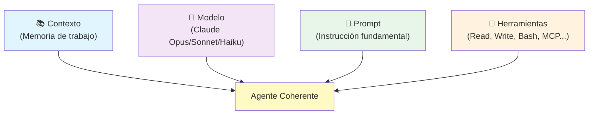
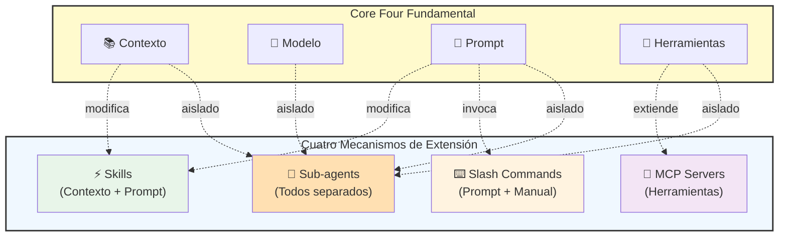
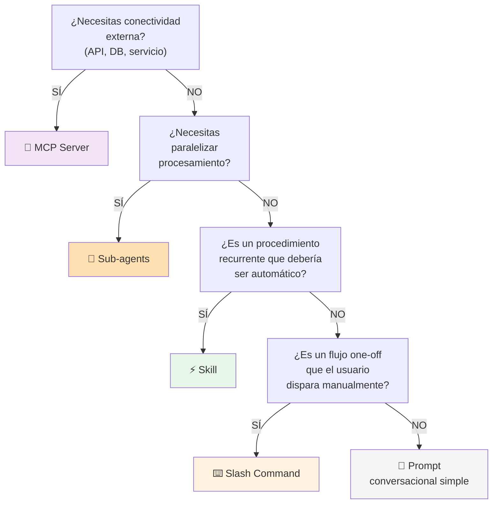
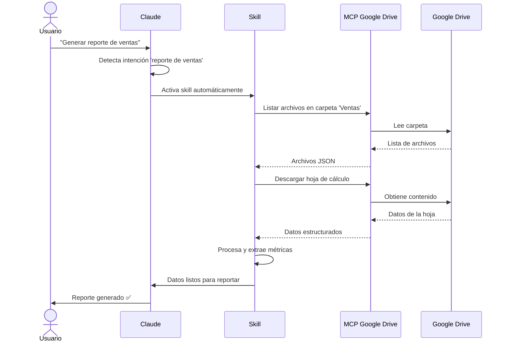
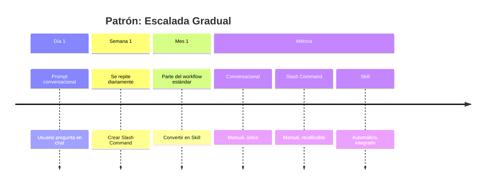
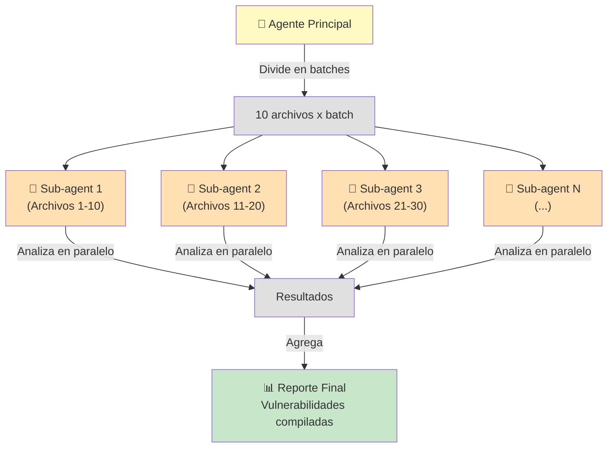
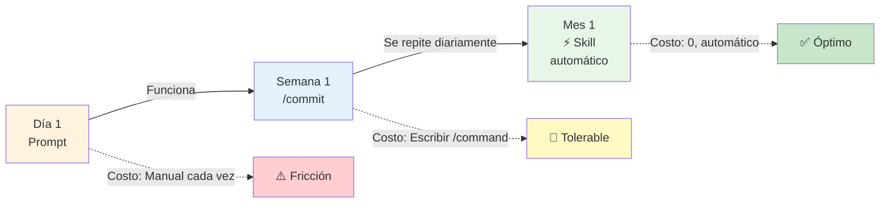
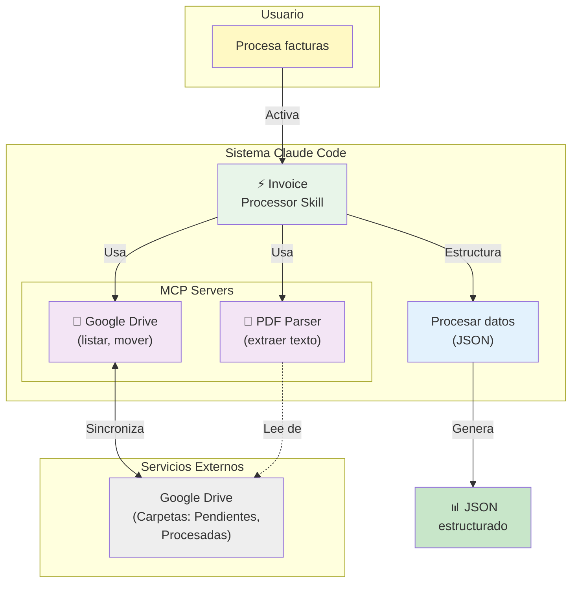

# Skills, MCP Servers, Sub-agents y Slash Commands en Claude Code: Guía Comparativa y Patrones de Uso

## Introducción: Cuatro Piezas, Un Sistema Composicional

En 2025, el desarrollo asistido por IA ha evolucionado más allá de los simples prompts en una interfaz de chat. Claude Code y herramientas similares ahora ofrecen múltiples mecanismos de extensión: **Skills**, **Slash Commands**, **MCP Servers** y **Sub-agents**. Entender cuándo usar cada uno no es solo una cuestión de preferencia personal, sino de arquitectura fundamental.

El error más común que cometen los desarrolladores al adoptar estas herramientas es tratarlas como alternativas intercambiables. Convertir todos los slash commands en skills, anidar sub-agents innecesariamente, o crear MCPs cuando un simple prompt bastaría. La realidad es que estas cuatro piezas **no son substitutos**, son **composicionales**: cada una resuelve un problema específico y juntas forman un sistema coherente para el desarrollo agentico.

Esta guía te ayudará a comprender cuándo usar cada mecanismo, cómo componen entre sí, y qué patrones de diseño aplicar para evitar la sobre-ingeniería. El objetivo no es maximizar el uso de todas las capacidades avanzadas, sino elegir la herramienta correcta para cada trabajo y mantener la arquitectura simple y mantenible.

## Fundamentos: La Arquitectura de Claude Code

Antes de comparar Skills, MCP, Sub-agents y Slash Commands, es crucial entender los **Core Four**: los cuatro elementos fundamentales que componen cualquier agente en Claude Code.

### Los Core Four

1. **Contexto**: La memoria de trabajo del agente. Incluye CLAUDE.md (instrucciones de proyecto), archivos leídos, conversación actual, y estado acumulado.

2. **Modelo**: El LLM subyacente (Claude Opus 4.5, Sonnet 4.5, Haiku 4.5). Determina capacidad de razonamiento, velocidad, y costo.

3. **Prompt**: La unidad fundamental de instrucción. Define qué debe hacer el agente, cómo debe pensarlo, y qué formato seguir.

4. **Herramientas**: Las capacidades que el agente puede invocar (Read, Write, Bash, Grep, MCP servers personalizados, etc.).



★ Insight ─────────────────────────────────────
Los Core Four son **elementos independientes** que se combinan para formar un agente funcional. Modificar cualquiera de ellos (cambiar modelo, mejorar prompt, agregar herramientas) afecta el comportamiento total. Las cuatro extensiones que veremos (Skills, Slash Commands, MCP, Sub-agents) son simplemente formas de modificar estos elementos de manera composicional.
─────────────────────────────────────────────────

### El Prompt Sigue Siendo Fundamental

Aquí está la verdad incómoda que muchos desarrolladores olvidan al emocionarse con Skills y Sub-agents: **el prompt es la unidad fundamental de todo**. No importa cuán sofisticada sea tu arquitectura de skills o cuántos MCP servers tengas configurados, todo se reduce a qué le estás diciendo al modelo que haga.

Esto significa:

- **Empezar con prompts simples**: Antes de crear un skill reutilizable, afina el prompt conversacionalmente.
- **Prompt engineering primero**: La mayoría de problemas se resuelven con mejor redacción del prompt, no con más abstracciones.
- **No entregar control prematuramente**: Subir a skills o sub-agents muy rápido puede oscurecer el reasoning crítico.

### Cómo Se Componen Estas Piezas

Los cuatro mecanismos (Skills, Slash Commands, MCP, Sub-agents) son formas de **modificar o extender los Core Four**:

- **Skills** modifican el contexto y el prompt automáticamente cuando el modelo detecta relevancia
- **Slash Commands** invocan prompts predefinidos manualmente con argumentos opcionales
- **MCP Servers** extienden las herramientas disponibles para conectar sistemas externos
- **Sub-agents** crean instancias separadas con su propio contexto, modelo, prompt y herramientas

La clave del diseño arquitectónico efectivo es entender qué estás modificando y por qué.



★ Insight ─────────────────────────────────────
Cada mecanismo de extensión **modifica un subconjunto diferente** de los Core Four. Un skill modifica contexto y prompt (automáticamente), un slash command solo invoca un prompt (manualmente), MCP extiende herramientas, y los sub-agents crean una **copia completamente aislada** de todos los elementos. Esto es la razón por la cual no son intercambiables - cada uno resuelve un problema diferente.
─────────────────────────────────────────────────

## Comparativa: Cuatro Tipos de Extensión

### Skills: Automatización Modelo-Invocada

**Definición**: Bloques de contexto y prompt reutilizables que Claude activa autónomamente cuando detecta relevancia.

**Características clave**:
- **Invocación**: El modelo decide cuándo activarlos basándose en la descripción
- **Ubicación**: `~/.claude/skills/`, `.claude/skills/`, o dentro de plugins
- **Estructura**: Directorio con `SKILL.md` (required) + archivos opcionales de soporte
- **Ámbito**: Contexto inyectado en la conversación actual

**Cuándo usarlos**:
- Procedimientos organizacionales que se aplican recurrentemente
- Directrices de marca o estilo que deben seguirse automáticamente
- Fórmulas o cálculos especializados que se usan frecuentemente
- Extracción de datos de formatos específicos (PDFs, logs, etc.)

**Ejemplo de SKILL.md**:
```yaml
---
description: Genera mensajes de commit siguiendo Conventional Commits con emojis según tipo
---

# Commit Message Skill

Cuando el usuario solicite crear un commit, genera el mensaje siguiendo esta estructura:

1. **Tipo con emoji**:
   - feat: ✨
   - fix: 🐛
   - docs: 📝
   - style: 💄
   - refactor: ♻️

2. **Formato**: `tipo(scope): descripción`

3. **Cuerpo** (opcional): Explicación de cambios complejos

Ejemplo:
```
✨ feat(auth): agregar autenticación con OAuth

Implementa flujo de OAuth 2.0 con Google y GitHub.
Incluye refresh tokens y manejo de expiración.
```
```

**Anti-patrón común**: Convertir todos los slash commands en skills. Si es un flujo que el usuario dispara manualmente y no se repite automáticamente, probablemente debería quedarse como slash command.

### Slash Commands: Control Usuario-Invocado

**Definición**: Comandos explícitos que el usuario ejecuta manualmente, con soporte para argumentos.

**Características clave**:
- **Invocación**: Manual, por el usuario escribiendo `/command`
- **Ubicación**: Definidos en settings de Claude Code
- **Estructura**: JSON con nombre, descripción, y prompt
- **Ámbito**: Ejecutan en el contexto de la conversación actual

**Cuándo usarlos**:
- Flujos one-off que requieren disparo manual
- Workflows específicos que el usuario controla explícitamente
- Acciones con parámetros variables (paths, nombres, valores)
- Tareas que están en fase de experimentación antes de automatizarse

**Ejemplo de configuración**:
```json
{
  "commands": [
    {
      "name": "review-pr",
      "description": "Analiza los cambios de un PR y genera comentarios de revisión",
      "prompt": "Revisa los cambios del PR actual:\n1. Lee git diff\n2. Identifica issues de código, seguridad, o performance\n3. Genera comentarios constructivos en formato markdown\n4. Sugiere mejoras sin ser pedante"
    }
  ]
}
```

**Escalada natural**: Si un slash command se usa recurrentemente y siempre en el mismo contexto, considera convertirlo en skill para automatización.

### MCP Servers: Conectividad Externa

**Definición**: Model Context Protocol servers que actúan como adaptadores universales a sistemas externos.

**Características clave**:
- **Invocación**: El modelo los usa como herramientas cuando necesita capacidades externas
- **Ubicación**: Configurados en settings, pueden ser locales o remotos
- **Estructura**: Ejecutables que exponen resources, tools, y prompts según el protocolo MCP
- **Ámbito**: Extienden las herramientas disponibles globalmente

**Cuándo usarlos**:
- Integración con servicios externos (Google Drive, Slack, GitHub)
- Acceso a bases de datos o APIs propias
- Herramientas del sistema que necesitas invocar programáticamente
- Cualquier funcionalidad que no viene incluida en Claude Code por defecto

**Ejemplos de uso común**:
- MCP Google Drive: Leer/escribir documentos en Drive
- MCP GitHub: Crear issues, comentar PRs, actualizar labels
- MCP Slack: Enviar mensajes, leer canales
- MCP Filesystem: Acceso extendido a filesystem con permisos específicos
- MCP Database: Ejecutar queries en PostgreSQL, MySQL, etc.

**Composición con Skills**: Un skill puede invocar tools de un MCP server. Ejemplo: un skill de "extracción de datos de PDF" puede usar un MCP server que maneja lectores especializados de PDF.

### Sub-agents: Especialización y Paralelismo

**Definición**: Instancias independientes de Claude con su propio contexto, prompt de sistema, y restricción de herramientas.

**Características clave**:
- **Invocación**: Explícitamente mediante llamadas a sub-agent
- **Ubicación**: Definidos en `.claude/agents/`
- **Estructura**: Archivo con system prompt y configuración de tools
- **Ámbito**: Contexto completamente aislado, no ven la conversación principal

**Cuándo usarlos**:
- **Paralelización**: Procesar múltiples items concurrentemente (analizar 10 archivos en paralelo)
- **Especialización**: Tareas que requieren contexto diferenciado (un agente solo para testing, otro solo para docs)
- **Restricción de herramientas**: Limitar deliberadamente qué puede hacer el agente (solo lectura, sin bash, etc.)

**Ejemplo de definición**:
```yaml
---
name: test-specialist
description: Agente especializado en escribir tests unitarios
---

# System Prompt

Eres un especialista en testing. Solo te enfocas en escribir tests unitarios con alta cobertura.

## Reglas:
- Usa Jest/Vitest según el proyecto
- Cubre edge cases y error handling
- No modifiques código de producción, solo tests
- Genera mocks cuando sea necesario

## Tools permitidas:
- Read: para leer código fuente
- Write: solo para archivos *.test.js o *.spec.js
- Grep: para encontrar patrones de testing
```

**Regla de oro**: Si necesitas paralelizar, usa sub-agents. Si solo necesitas contexto especializado sin paralelismo, considera si un skill con instrucciones claras bastaría.

### Tabla Comparativa

| Característica | Skills | Slash Commands | MCP Servers | Sub-agents |
|----------------|--------|----------------|-------------|------------|
| **Invocación** | Automática (modelo) | Manual (usuario) | Automática (como tool) | Explícita (llamada) |
| **Cuándo se activa** | Cuando descripción coincide con contexto | Cuando usuario escribe `/cmd` | Cuando modelo necesita capacidad externa | Cuando se invoca programáticamente |
| **Contexto** | Compartido con conversación | Compartido con conversación | N/A (es una herramienta) | Aislado, independiente |
| **Reusabilidad** | Alta (automática) | Media (manual repetible) | Muy alta (global) | Media (especialización) |
| **Paralelización** | No | No | No directamente | Sí (core use case) |
| **Complejidad setup** | Media (SKILL.md) | Baja (JSON simple) | Alta (protocolo MCP) | Media (agent config) |
| **Caso típico** | "Siempre sigue estos pasos de testing" | "Analiza este PR ahora" | "Conéctate a Slack" | "Procesa estos 10 archivos en paralelo" |

## Matriz de Decisión: Cuándo Usar Cada Uno

### Árbol de Decisión



### Ejemplos Concretos por Camino

**Caso: Generar mensajes de commit**
- **Primera vez**: Prompt conversacional ("genera un commit message para estos cambios")
- **Se repite frecuentemente**: Slash command `/commit-msg` para control manual
- **Se usa en todos los commits**: Skill que se activa automáticamente al detectar `git commit`

**Caso: Enviar notificaciones a Slack**
- **Solución**: MCP Server de Slack
- **Por qué no un skill**: Requiere integración externa, no solo contexto
- **Por qué no un sub-agent**: No necesitas aislamiento ni paralelización

**Caso: Analizar 50 archivos de log para encontrar patrones**
- **Solución**: Sub-agents (uno por cada 5 archivos, por ejemplo)
- **Por qué no un skill**: Requiere paralelización, un skill ejecutaría secuencialmente
- **Por qué no un slash command**: Es trabajo computacional, no un flujo manual simple

**Caso: Aplicar directrices de marca en documentación**
- **Solución**: Skill con las reglas de estilo
- **Por qué no un slash command**: Debería aplicarse automáticamente, no manualmente
- **Por qué no un MCP**: No requiere conectividad externa
- **Por qué no un sub-agent**: No requiere paralelización ni contexto aislado

### Anti-patrones Comunes

**❌ Skill-itis**: Convertir todo en skills
- Síntoma: Tienes 30+ skills y no estás seguro cuáles se activan
- Problema: Descripciones vagas que causan activaciones incorrectas
- Solución: Empezar con prompts, escalar solo lo recurrente

**❌ MCP para todo**: Crear MCPs cuando no hay integración externa
- Síntoma: MCP que solo lee/escribe archivos locales
- Problema: Overhead innecesario, ya tienes esas herramientas
- Solución: Usar tools nativas de Claude Code primero

**❌ Sub-agents anidados**: Crear cadenas largas de sub-agents llamando sub-agents
- Síntoma: "Subagent A llama a Subagent B que llama a Subagent C"
- Problema: Debugging imposible, fiabilidad baja, contexto fragmentado
- Solución: Máximo 2 niveles de profundidad, preferir composición horizontal

**❌ Slash commands para todo**: Crear 50 comandos para cada tarea
- Síntoma: Lista de `/` que parece una aplicación CLI completa
- Problema: Carga cognitiva alta, difícil recordar todos
- Solución: Solo flujos verdaderamente recurrentes y manuales

## Patrones de Composición

Las cuatro piezas no existen en aislamiento. Los patrones más poderosos surgen de combinarlas inteligentemente.

### Patrón 1: Skill + MCP (Automatización con Conectividad)

**Caso de uso**: Extraer datos de documentos en Google Drive y generar reportes

```yaml
# .claude/skills/drive-report-extractor/SKILL.md
---
description: Extrae datos de hojas de cálculo en Drive y genera reportes en markdown
---

Cuando el usuario pida "generar reporte de ventas" o similar:

1. Usa el MCP de Google Drive para listar archivos en la carpeta "Ventas"
2. Lee las hojas de cálculo del mes actual
3. Extrae métricas clave (total, promedio, top 5 productos)
4. Genera un reporte en markdown con gráficos en ASCII
5. Guarda el reporte en `reports/ventas-YYYY-MM.md`
```

**Por qué funciona**: El skill proporciona el procedimiento automático, el MCP proporciona la conectividad. Claude activa el skill cuando detecta la intención y usa el MCP como herramienta.



★ Insight ─────────────────────────────────────
**Composición Skill + MCP = Automatización potente**. El skill define el "qué y cuándo", el MCP define el "cómo conectar". Docusaurus renderizará este diagrama automáticamente - la sintaxis Mermaid es nativa en Docusaurus 3.
─────────────────────────────────────────────────

### Patrón 2: Prompt → Slash Command → Skill (Escalada Gradual)

**Evolución de una funcionalidad de testing**:

**Fase 1: Prompt conversacional**
```
Usuario: "Genera tests para este componente React"
Claude: [Analiza componente, escribe tests]
```

**Fase 2: Se repite frecuentemente → Slash Command**
```json
{
  "name": "gen-tests",
  "description": "Genera tests unitarios para componente React",
  "prompt": "Lee el componente en {path}, analiza props y state, genera tests con React Testing Library cubriendo rendering, eventos, y edge cases"
}
```

**Fase 3: Es parte del workflow estándar → Skill**
```yaml
---
description: Genera automáticamente tests cuando se crea un componente React nuevo
---

Cuando detectes que se ha creado un archivo .jsx o .tsx nuevo:
1. Analiza el componente
2. Genera archivo de tests correspondiente en __tests__/
3. Cubre rendering básico, props, y eventos
```

**Lección**: No saltar directamente a skills. Dejar que el patrón de uso emerja naturalmente.



★ Insight ─────────────────────────────────────
**Esta escalada no es aleatoria**. Cada etapa proporciona retroalimentación sobre si el siguiente nivel de abstracción está justificado. Si un prompt conversacional se usa una sola vez, no necesita slash command. Si un slash command se invoca manualmente cada día, merece automatización como skill.
─────────────────────────────────────────────────

### Patrón 3: Sub-agents para Procesamiento Paralelo con Agregación

**Caso de uso**: Analizar codebase grande para identificar vulnerabilidades de seguridad

```javascript
// Llamada desde agente principal
const files = await glob("**/*.js");
const batches = chunk(files, 10); // 10 archivos por sub-agent

const results = await Promise.all(
  batches.map(batch =>
    invokeSubAgent("security-analyzer", { files: batch })
  )
);

// Agregar resultados
const vulnerabilities = results.flat();
generateReport(vulnerabilities);
```

**Sub-agent `security-analyzer`**:
```yaml
---
name: security-analyzer
description: Analiza archivos JavaScript buscando vulnerabilidades de seguridad
---

# System Prompt

Analiza los archivos proporcionados buscando:
- SQL injection
- XSS vulnerabilities
- Insecure dependencies
- Hardcoded secrets

Para cada issue encontrado, reporta:
- Archivo y línea
- Tipo de vulnerabilidad
- Severidad (baja/media/alta/crítica)
- Recomendación de fix
```

**Por qué funciona**: Los sub-agents procesan batches en paralelo, el agente principal agrega resultados. Sin paralelización, analizar 1000 archivos sería lentísimo.



★ Insight ─────────────────────────────────────
**Paralelización = Aceleración exponencial**. Si analizas 100 archivos secuencialmente a 2 minutos por agente = 200 minutos. Con 10 sub-agents en paralelo = 20 minutos. Pero cada sub-agent es una instancia completamente aislada, lo que mantiene el contexto manejable y evita contaminación entre batches.
─────────────────────────────────────────────────

### Patrón 4: CLAUDE.md como Contexto Base + Skills como Especialización

**CLAUDE.md (contexto global del proyecto)**:
```markdown
# Proyecto: E-commerce Platform

## Stack
- Frontend: Next.js 14, TypeScript, Tailwind
- Backend: Node.js, Express, PostgreSQL
- Testing: Jest, React Testing Library

## Convenciones
- Todos los componentes en TypeScript
- Tests en `__tests__/` directories
- API routes en `pages/api/`
```

**Skill específico**:
```yaml
---
description: Genera componentes React siguiendo convenciones del proyecto
---

Al crear componentes React nuevos:
1. Usa TypeScript (según CLAUDE.md)
2. Aplica Tailwind para estilos
3. Incluye PropTypes con JSDoc
4. Genera test correspondiente en __tests__/
5. Exporta como named export
```

**Por qué funciona**: CLAUDE.md establece contexto base que todos (skills, sub-agents, conversación principal) comparten. Skills añaden especialización sin repetir contexto global.

### Evitar la Sobre-ingeniería

**Regla del 80/20**: El 80% de tus necesidades se resuelven con prompts conversacionales bien redactados. Solo el 20% requiere skills, sub-agents, o MCPs personalizados.

**Checklist antes de crear abstracciones**:
- ✅ ¿He refinado el prompt conversacionalmente al menos 3 veces?
- ✅ ¿Este patrón se repite al menos 5 veces por semana?
- ✅ ¿La automatización realmente ahorra tiempo vs. invocación manual?
- ✅ ¿La descripción del skill es lo suficientemente específica para activarse correctamente?
- ✅ ¿El sub-agent realmente necesita contexto aislado o paralelización?

Si respondes "no" a alguna, probablemente no necesitas la abstracción todavía.

## Ejemplos Prácticos

### Ejemplo 1: Sistema de Commit Messages (Escalada Completa)

**Contexto**: Equipo que quiere estandarizar mensajes de commit siguiendo Conventional Commits.

**Fase 1: Prompt conversacional (día 1)**
```
Usuario: "Genera un commit message para estos cambios"
Claude: [Lee git diff, genera mensaje]
```

**Fase 2: Slash Command (semana 1, se repite diariamente)**
```json
{
  "name": "commit",
  "description": "Genera mensaje de commit siguiendo Conventional Commits",
  "prompt": "Lee git diff, analiza cambios, genera mensaje de commit siguiendo Conventional Commits (feat/fix/docs/etc). Incluye scope si aplica. Descripción concisa en imperativo."
}
```

**Uso**:
```
Usuario: /commit
Claude: [Analiza cambios, genera]
```

**Fase 3: Skill (mes 1, es parte del workflow estándar)**
```yaml
---
description: Genera mensajes de commit automáticamente siguiendo Conventional Commits cuando el usuario mencione crear un commit
---

# Commit Message Skill

Cuando el usuario solicite crear un commit o mencione "commit these changes":

1. Lee `git diff --staged` para ver cambios preparados
2. Analiza la naturaleza de los cambios:
   - feat: nueva funcionalidad
   - fix: corrección de bug
   - docs: cambios en documentación
   - style: formateo, sin cambios de lógica
   - refactor: reestructuración de código
   - test: añadir o corregir tests

3. Genera mensaje con formato:
   ```
   tipo(scope): descripción breve

   [cuerpo opcional explicando el "por qué"]
   ```

4. Usa imperativo ("add" no "added"), primera línea ≤50 caracteres
```

**Reasoning de la escalada**:
- **Prompt → Slash Command**: Se usa diariamente, merece un comando rápido
- **Slash Command → Skill**: Es parte del workflow de todos los commits, la automatización elimina fricción



### Ejemplo 2: Procesamiento de Documentos (Skill + MCP)

**Contexto**: Startup que necesita procesar facturas PDF subidas a Google Drive.

**Solución**: Skill + MCP Google Drive + MCP PDF Parser

**MCP Setup** (en settings):
```json
{
  "mcpServers": {
    "google-drive": {
      "command": "npx",
      "args": ["-y", "@modelcontextprotocol/server-gdrive"]
    },
    "pdf-parser": {
      "command": "python",
      "args": ["/path/to/pdf_parser_mcp.py"]
    }
  }
}
```

**Skill**:
```yaml
---
description: Procesa facturas PDF de Google Drive y extrae datos estructurados
---

# Invoice Processor Skill

Cuando el usuario pida "procesar facturas" o "extraer datos de facturas":

1. **Listar archivos**:
   - Usa MCP Google Drive para listar archivos en carpeta "Facturas/Pendientes"
   - Filtra solo PDFs del mes actual

2. **Extraer datos**:
   - Para cada PDF, usa MCP PDF Parser para extraer texto
   - Identifica campos clave:
     * Número de factura
     * Fecha
     * Proveedor
     * Monto total
     * Items y cantidades

3. **Estructurar datos**:
   - Genera JSON con datos extraídos
   - Valida que todos los campos requeridos estén presentes

4. **Guardar resultados**:
   - Escribe JSON a `data/invoices/YYYY-MM.json`
   - Mueve PDFs procesados a carpeta "Facturas/Procesadas" en Drive

5. **Reportar**:
   - Resume cantidad de facturas procesadas
   - Lista cualquier PDF con datos incompletos
```

**Flujo de uso**:
```
Usuario: "Procesa las facturas de este mes"
Claude: [Skill se activa]
         → Llama a MCP Google Drive (listar archivos)
         → Llama a MCP PDF Parser (extraer texto)
         → Genera JSON estructurado
         → Mueve archivos en Drive
         → Reporta resultados
```



**Por qué esta arquitectura**:
- **Skill**: Procedimiento recurrente (cada mes), debe ser automático
- **MCP Google Drive**: Conectividad externa a Drive
- **MCP PDF Parser**: Funcionalidad especializada no nativa en Claude Code
- **No sub-agents**: No hay necesidad de paralelización (pocas facturas) ni especialización de contexto

★ Insight ─────────────────────────────────────
Observa cómo **Skill + MCP** permite a Claude "razonar" sobre tareas complejas sin escribir código. El skill describe el flujo conceptualmente, los MCPs manejan la conectividad técnica. Sin this pattern, terminarías escribiendo scripts bash complejos o aplicaciones personalizadas.
─────────────────────────────────────────────────

### Ejemplo 3: Análisis Paralelo de Codebase (Sub-agents)

**Contexto**: Analizar codebase de 500 archivos para generar documentación de API.

**Solución**: Sub-agents para paralelizar procesamiento

**Sub-agent `api-doc-generator`**:
```yaml
---
name: api-doc-generator
description: Analiza archivos de código y genera documentación de API
---

# System Prompt

Eres un especialista en documentación de APIs. Analiza los archivos proporcionados y genera documentación en formato markdown.

## Para cada endpoint/función:
- Nombre y signatura
- Descripción de qué hace
- Parámetros (tipo, requerido/opcional, descripción)
- Retorno (tipo, descripción)
- Ejemplos de uso
- Errores posibles

## Formato:
Usa markdown con headers apropiados. Incluye ejemplos de código.

## Tools permitidas:
- Read: para leer archivos de código
```

**Script de invocación** (desde agente principal o slash command):
```javascript
// Desde prompt del agente principal o slash command

// 1. Encontrar todos los archivos de API
const apiFiles = await glob("src/api/**/*.js");

// 2. Dividir en batches de 10 archivos
const batches = [];
for (let i = 0; i < apiFiles.length; i += 10) {
  batches.push(apiFiles.slice(i, i + 10));
}

// 3. Procesar en paralelo con sub-agents
console.log(`Procesando ${apiFiles.length} archivos en ${batches.length} batches...`);

const results = await Promise.all(
  batches.map((batch, idx) => {
    return invokeSubAgent("api-doc-generator", {
      files: batch,
      outputFile: `docs/api/batch-${idx}.md`
    });
  })
);

// 4. Agregar resultados en un índice
const indexContent = `# API Documentation\n\n` +
  results.map((r, i) => `- [Batch ${i}](./batch-${i}.md)`).join('\n');

await writeFile('docs/api/index.md', indexContent);

console.log(`✅ Documentación generada en docs/api/`);
```

**Por qué sub-agents**:
- **Paralelización**: 500 archivos secuencialmente tomaría horas, con 10 sub-agents procesando 50 archivos cada uno es mucho más rápido
- **Contexto aislado**: Cada sub-agent solo ve su batch, evita contaminar contexto
- **Restricción de herramientas**: El sub-agent solo necesita Read, no puede modificar código accidentalmente

**Por qué NO alternatives**:
- **Skill solo**: No puede paralelizar, sería secuencial
- **Prompt simple**: Contexto explotaría con 500 archivos
- **MCP**: No hay integración externa, solo procesamiento

## Mejores Prácticas y Lecciones Aprendidas

### Keep Skills Focused

**❌ Mal: Skill genérico que hace demasiado**
```yaml
---
description: Ayuda con el desarrollo web
---

Ayuda con HTML, CSS, JavaScript, React, Vue, testing, deployment, y debugging.
```

**Problema**: Descripción demasiado vaga, se activará en contextos incorrectos.

**✅ Bien: Skill específico**
```yaml
---
description: Genera componentes React con TypeScript siguiendo convenciones del proyecto
---

Cuando el usuario pida crear un componente React:
1. Usa TypeScript
2. Aplica props typing con interface
3. Incluye JSDoc
4. Genera test correspondiente
```

**Lección**: Un skill debe resolver **una cosa bien**, no muchas cosas mediocre.

### Write Specific Descriptions

La descripción del skill es **crítica** para que Claude lo active correctamente.

**❌ Mal**:
```yaml
---
description: Ayuda con commits
---
```

**✅ Bien**:
```yaml
---
description: Genera mensajes de commit siguiendo Conventional Commits cuando el usuario mencione crear un commit o commit changes
---
```

**Tips**:
- Incluir palabras clave que el usuario usaría ("crear commit", "commit changes")
- Ser específico sobre el dominio ("Conventional Commits", no solo "commits")
- Evitar ambigüedad ("ayuda con" es vago)

### Restrict Tools en Sub-agents

**❌ Mal: Sub-agent con acceso completo**
```yaml
---
name: doc-generator
---

Genera documentación del código.

# Tools: todas disponibles
```

**Problema**: Si un bug en el prompt, podría modificar código de producción accidentalmente.

**✅ Bien: Restrict tools a lo necesario**
```yaml
---
name: doc-generator
tools:
  - Read
  - Write: "docs/**/*.md"  # Solo puede escribir en docs/
---

Genera documentación del código.
```

**Lección**: Aplicar principio de least privilege. Si el sub-agent solo lee código y escribe docs, no necesita Bash, Grep, ni Write en otros directorios.

### Prompt Engineering Primero

**Workflow recomendado**:

1. **Empezar conversacional**: Refinar el prompt en conversación hasta que funcione perfectamente
2. **Capturar el prompt final**: Guardar la versión que funciona
3. **Evaluar reusabilidad**: ¿Se usará frecuentemente? ¿Es siempre igual?
4. **Escalar gradualmente**:
   - Si es manual y frecuente → Slash command
   - Si debe ser automático → Skill
   - Si necesita paralelismo → Sub-agent
   - Si necesita integración externa → MCP

**Anti-patrón**: Saltar directamente a crear skills sin probar el prompt conversacionalmente. Resultado: skills con prompts mal refinados que no funcionan bien.

### Composición > Sobre-ingeniería

**❌ Mal: Arquitectura innecesariamente compleja**
```
Skill A llama a Sub-agent B que usa MCP C que llama a otro Sub-agent D
```

**Problema**: Debugging imposible, cadena de dependencias frágil, fiabilidad baja.

**✅ Bien: Composición simple**
```
Skill usa MCP directamente
O: Sub-agents paralelos que reportan a agente principal
```

**Regla**: Máximo **2 niveles de profundidad** en composición. Preferir composición horizontal (sub-agents en paralelo) sobre vertical (anidamiento).

### Testing e Iteración

**Skills y Sub-agents necesitan testing**:

1. **Crear casos de prueba**: Situaciones específicas donde el skill debería activarse
2. **Verificar activación**: ¿Se activa cuando debe? ¿No se activa cuando no debe?
3. **Probar edge cases**: Inputs malformados, archivos inexistentes, etc.
4. **Iterar descripciones**: Refinar descripción del skill según falsos positivos/negativos

**Ejemplo de test log**:
```markdown
# Test: Commit Message Skill

## Caso 1: Usuario dice "create a commit"
- ✅ Skill se activó
- ✅ Generó mensaje Conventional Commit correcto

## Caso 2: Usuario dice "what's the last commit?"
- ❌ Skill se activó (falso positivo)
- Fix: Mejorar descripción para especificar "crear" no "consultar"

## Caso 3: Usuario hace commit con git directamente
- ⚠️ Skill no se activó (esperado, no hay mención en conversación)
```

## Conclusión: Skills como Nivel Composicional Superior

Skills, MCP Servers, Sub-agents y Slash Commands no son tecnologías competidoras, son piezas complementarias de un sistema composicional. Entender cuándo usar cada uno es la diferencia entre una arquitectura elegante y un sistema sobre-ingenierizado.

**El prompt es la unidad fundamental**. Todo lo demás (skills, sub-agents, MCPs) son formas de componer, reutilizar, y escalar prompts. No entregues el control a abstracciones complejas prematuramente. Empieza con prompts conversacionales, refina, y solo entonces escala.

**Skills son automatización contextual**. Cuando un procedimiento se repite frecuentemente y debe ser automático, skills son la respuesta. Pero no conviertas todo en skills. La carga cognitiva de 50 skills con descripciones vagas es peor que 5 slash commands bien documentados.

**MCP es conectividad**. Para integrar sistemas externos, no hay substituto. Pero no crees un MCP solo porque puedes. Usa las herramientas nativas de Claude Code cuando basten.

**Sub-agents son para paralelismo y especialización**. Si necesitas procesar 100 archivos en paralelo, o restringir deliberadamente el contexto y herramientas de una tarea, sub-agents son ideales. Pero evita cadenas largas de sub-agents anidados.

**Slash commands son control manual**. Para flujos que el usuario dispara explícitamente y que están en fase de experimentación, slash commands proveen el balance perfecto entre reusabilidad y flexibilidad.

El futuro de la programación agentica no es maximizar el uso de todas las capacidades avanzadas, sino elegir la herramienta correcta para cada trabajo y componer con elegancia. Keep it simple, iterate, y escala solo cuando el patrón de uso lo justifique.

## Referencias y Recursos

### Documentación Oficial

- [Claude Code Docs - Inicio](https://code.claude.com/docs)
- [Skills en Claude Code](https://code.claude.com/docs/en/skills)
- [Sub-agents en Claude Code](https://code.claude.com/docs/en/sub-agents)
- [Model Context Protocol Specification](https://modelcontextprotocol.io)
- [Repositorio de MCP Servers oficiales](https://github.com/modelcontextprotocol/servers)

### Artículos y Guías

- [Skills Explained - Anthropic Blog](https://claude.com/blog/skills-explained)
- [Claude Code Best Practices](https://www.anthropic.com/engineering/claude-code-best-practices)
- [Understanding Claude Code's Full Stack: MCP, Skills, Subagents, and Hooks](https://alexop.dev/posts/understanding-claude-code-full-stack/)
- [Video: Skills Composicionales en Claude Code](https://www.youtube.com/watch?v=kFpLzCVLA20)

### Estándares y Convenciones

- [Conventional Commits](https://www.conventionalcommits.org/)
- [Semantic Versioning](https://semver.org/)

---

*Última actualización: Diciembre 2025*
