import ModuleCompleteButton from '@site/src/components/ModuleCompleteButton';

# Módulo 3: Conceptos Clave de IA Agents

Este módulo te enseñará los patrones fundamentales que hacen que un agente de IA sea realmente autónomo. Aprenderás cómo los agentes usan herramientas, razonan sobre problemas, y mantienen estado entre interacciones.

**⏱️ Duración estimada:** 2.5 horas

## 🎯 Requisitos Previos

- **Módulo 2 completado**: Dominas TypeScript básico, Zod para validación, y tipos para la API de Claude
- **Proyecto del Módulo 2 funcionando**: Tu agente calculadora tipado ejecuta correctamente
- **Entiendes el patrón Result**: Sabes manejar errores de forma tipada

### Lo que NO necesitas

- Experiencia previa construyendo agentes
- Conocimiento de frameworks de agentes (LangChain, AutoGPT)
- Entender arquitecturas complejas (multi-agente, RAG)

## 📖 Contenido

### 1. Tool Calling: Las Manos del Agente

En el Módulo 1 aprendiste que el LLM es el "cerebro" que decide, pero necesita "manos" para actuar. **Tool calling** (también llamado "function calling") es el mecanismo que permite al LLM ejecutar acciones en el mundo real.

#### Anatomía de una herramienta

```typescript
// Una herramienta tiene 3 componentes esenciales
interface Tool {
  // 1. Nombre único que el LLM usará para invocarla
  name: string;

  // 2. Descripción que el LLM lee para decidir cuándo usarla
  description: string;

  // 3. Esquema JSON que define los parámetros esperados
  input_schema: {
    type: 'object';
    properties: Record<string, PropertySchema>;
    required: string[];
  };
}
```

#### El flujo de Tool Calling

```mermaid
flowchart TB
    subgraph flow["🔧 FLUJO DE TOOL CALLING"]
        A["👤 Usuario envía mensaje<br/>'¿Cuál es el clima en Madrid?'"]
        B["🧠 LLM analiza y decide usar herramienta<br/>tool: 'get_weather', input: { city: 'Madrid' }"]
        C["⚙️ Tu código ejecuta la herramienta<br/>weatherAPI.get('Madrid')"]
        D["📤 Envías resultado al LLM<br/>{ temperature: 22, condition: 'sunny' }"]
        E["💬 LLM genera respuesta final<br/>'El clima en Madrid es soleado con 22°C'"]

        A --> B
        B --> C
        C --> D
        D --> E
    end

    style A fill:#e3f2fd,stroke:#1976d2,stroke-width:2px,color:#0d47a1
    style B fill:#f3e5f5,stroke:#7b1fa2,stroke-width:2px,color:#4a148c
    style C fill:#e8f5e9,stroke:#388e3c,stroke-width:2px,color:#1b5e20
    style D fill:#fff3e0,stroke:#f57c00,stroke-width:2px,color:#e65100
    style E fill:#e1f5fe,stroke:#0288d1,stroke-width:2px,color:#01579b
```



#### Implementación con Claude API

```typescript
import Anthropic from '@anthropic-ai/sdk';

const client = new Anthropic();

// Definir herramientas disponibles
const tools: Anthropic.Tool[] = [
  {
    name: 'get_weather',
    description: 'Obtiene el clima actual de una ciudad. Usa esto cuando el usuario pregunte sobre el tiempo o clima.',
    input_schema: {
      type: 'object',
      properties: {
        city: {
          type: 'string',
          description: 'Nombre de la ciudad (ej: "Madrid", "Buenos Aires")'
        },
        units: {
          type: 'string',
          enum: ['celsius', 'fahrenheit'],
          description: 'Unidades de temperatura'
        }
      },
      required: ['city']
    }
  },
  {
    name: 'search_web',
    description: 'Busca información en internet. Usa esto para información actualizada o que no conoces.',
    input_schema: {
      type: 'object',
      properties: {
        query: {
          type: 'string',
          description: 'Términos de búsqueda'
        },
        max_results: {
          type: 'number',
          description: 'Número máximo de resultados (1-10)'
        }
      },
      required: ['query']
    }
  }
];

// Enviar mensaje con herramientas disponibles
const response = await client.messages.create({
  model: 'claude-sonnet-4-20250514',
  max_tokens: 1024,
  tools: tools,
  messages: [
    { role: 'user', content: '¿Cómo está el clima en Madrid?' }
  ]
});

// Procesar respuesta
for (const block of response.content) {
  if (block.type === 'tool_use') {
    console.log(`LLM quiere usar: ${block.name}`);
    console.log(`Con parámetros:`, block.input);
    // Aquí ejecutarías la herramienta real
  }
}
```

#### Buenas prácticas para herramientas

| Práctica | Por qué importa |
|----------|-----------------|
| Nombres descriptivos | `get_current_weather` > `weather` > `gw` |
| Descripciones detalladas | El LLM decide basándose en ellas |
| Parámetros con defaults | Reduce errores de invocación |
| Validación estricta | Previene ejecuciones con datos inválidos |
| Respuestas estructuradas | El LLM puede interpretar mejor los resultados |

### 2. El Patrón ReAct: Razonar + Actuar

**ReAct** (Reasoning + Acting) es el patrón fundamental de los agentes modernos. En lugar de solo responder, el agente:

1. **Razona** sobre qué hacer
2. **Actúa** ejecutando una herramienta
3. **Observa** el resultado
4. **Repite** hasta completar la tarea

#### El ciclo ReAct

```mermaid
flowchart TB
    subgraph react["🔄 CICLO ReAct"]
        T["💭 THOUGHT<br/>(Razonar)<br/>'Necesito buscar información<br/>sobre TypeScript...'"]
        A["⚡ ACTION<br/>(Actuar)<br/>search_web({ query: 'TypeScript' })"]
        O["👁️ OBSERVATION<br/>(Observar)<br/>[{ title: 'TS Handbook', ... }]"]
        Q{"¿Listo?"}
        F["✅ Respuesta Final"]
    end

    T --> A
    A --> O
    O --> Q
    Q -->|Sí| F
    Q -->|No| T

    style T fill:#e8eaf6,stroke:#3f51b5,stroke-width:2px,color:#1a237e
    style A fill:#fff3e0,stroke:#ff9800,stroke-width:2px,color:#e65100
    style O fill:#e0f2f1,stroke:#009688,stroke-width:2px,color:#004d40
    style Q fill:#fce4ec,stroke:#e91e63,stroke-width:2px,color:#880e4f
    style F fill:#e8f5e9,stroke:#4caf50,stroke-width:2px,color:#1b5e20
```



#### Implementación del patrón ReAct

```typescript
import { z } from 'zod';

// Esquema para la respuesta del agente
const AgentThoughtSchema = z.object({
  thought: z.string().describe('Razonamiento del agente'),
  action: z.discriminatedUnion('type', [
    z.object({
      type: z.literal('tool'),
      name: z.string(),
      input: z.record(z.unknown())
    }),
    z.object({
      type: z.literal('final_answer'),
      answer: z.string()
    })
  ])
});

type AgentThought = z.infer<typeof AgentThoughtSchema>;

class ReActAgent {
  private client: Anthropic;
  private tools: Map<string, Tool>;
  private maxIterations: number;

  constructor(tools: Tool[], maxIterations = 10) {
    this.client = new Anthropic();
    this.tools = new Map(tools.map(t => [t.name, t]));
    this.maxIterations = maxIterations;
  }

  async run(task: string): Promise<string> {
    const history: Array<{ role: string; content: string }> = [];
    let iteration = 0;

    // Prompt del sistema que implementa ReAct
    const systemPrompt = `Eres un agente que resuelve tareas paso a paso.

Para cada paso, responde con JSON:
{
  "thought": "Tu razonamiento sobre qué hacer",
  "action": {
    "type": "tool",
    "name": "nombre_herramienta",
    "input": { ... parámetros ... }
  }
}

O cuando tengas la respuesta final:
{
  "thought": "He completado la tarea porque...",
  "action": {
    "type": "final_answer",
    "answer": "Tu respuesta final al usuario"
  }
}

Herramientas disponibles:
${Array.from(this.tools.values()).map(t =>
  `- ${t.name}: ${t.description}`
).join('\n')}

IMPORTANTE: Siempre razona antes de actuar. Explica tu pensamiento.`;

    history.push({ role: 'user', content: task });

    while (iteration < this.maxIterations) {
      iteration++;
      console.log(`\n📍 Iteración ${iteration}/${this.maxIterations}`);

      // Obtener siguiente pensamiento/acción del LLM
      const response = await this.client.messages.create({
        model: 'claude-sonnet-4-20250514',
        max_tokens: 1024,
        system: systemPrompt,
        messages: history.map(m => ({
          role: m.role as 'user' | 'assistant',
          content: m.content
        }))
      });

      const text = response.content[0];
      if (text.type !== 'text') continue;

      // Parsear respuesta
      let thought: AgentThought;
      try {
        thought = AgentThoughtSchema.parse(JSON.parse(text.text));
      } catch (e) {
        console.error('Error parseando respuesta:', e);
        continue;
      }

      console.log(`💭 Thought: ${thought.thought}`);
      history.push({ role: 'assistant', content: text.text });

      // Verificar si es respuesta final
      if (thought.action.type === 'final_answer') {
        console.log(`✅ Respuesta final alcanzada`);
        return thought.action.answer;
      }

      // Ejecutar herramienta
      const tool = this.tools.get(thought.action.name);
      if (!tool) {
        const error = `Herramienta "${thought.action.name}" no existe`;
        history.push({ role: 'user', content: `Observation: ERROR - ${error}` });
        continue;
      }

      console.log(`🔧 Action: ${thought.action.name}(${JSON.stringify(thought.action.input)})`);

      try {
        const result = await tool.execute(thought.action.input);
        const observation = `Observation: ${JSON.stringify(result)}`;
        console.log(`👁️ ${observation}`);
        history.push({ role: 'user', content: observation });
      } catch (e) {
        const error = `Observation: ERROR - ${(e as Error).message}`;
        console.log(`❌ ${error}`);
        history.push({ role: 'user', content: error });
      }
    }

    throw new Error(`Agente excedió ${this.maxIterations} iteraciones`);
  }
}
```

### 3. State Management: La Memoria del Agente

Los agentes necesitan mantener estado entre interacciones. Sin estado, cada mensaje es independiente y el agente "olvida" lo que hizo.

#### Tipos de estado en agentes

```typescript
// 1. Estado de conversación (corto plazo)
interface ConversationState {
  messages: Message[];           // Historial de mensajes
  currentTask: string | null;    // Tarea actual
  pendingToolCalls: ToolCall[];  // Herramientas pendientes
}

// 2. Estado de sesión (medio plazo)
interface SessionState {
  userId: string;
  startedAt: Date;
  context: Record<string, unknown>;  // Datos recolectados
  completedTasks: string[];          // Tareas completadas
  preferences: UserPreferences;       // Preferencias aprendidas
}

// 3. Estado persistente (largo plazo)
interface PersistentState {
  knowledgeBase: Document[];     // Conocimiento acumulado
  userHistory: Interaction[];    // Historial de interacciones
  learnedPatterns: Pattern[];    // Patrones aprendidos
}
```

#### Implementación de estado de conversación

```typescript
import { z } from 'zod';

// Esquema para mensajes
const MessageSchema = z.object({
  role: z.enum(['user', 'assistant', 'system']),
  content: z.string(),
  timestamp: z.date(),
  metadata: z.record(z.unknown()).optional()
});

type Message = z.infer<typeof MessageSchema>;

class ConversationManager {
  private messages: Message[] = [];
  private maxMessages: number;
  private maxTokensEstimate: number;

  constructor(maxMessages = 50, maxTokensEstimate = 100000) {
    this.maxMessages = maxMessages;
    this.maxTokensEstimate = maxTokensEstimate;
  }

  addMessage(role: Message['role'], content: string, metadata?: Record<string, unknown>): void {
    this.messages.push({
      role,
      content,
      timestamp: new Date(),
      metadata
    });

    // Mantener límite de mensajes
    this.pruneIfNeeded();
  }

  getMessages(): Message[] {
    return [...this.messages];
  }

  getMessagesForAPI(): Array<{ role: 'user' | 'assistant'; content: string }> {
    return this.messages
      .filter(m => m.role !== 'system')
      .map(m => ({
        role: m.role as 'user' | 'assistant',
        content: m.content
      }));
  }

  private pruneIfNeeded(): void {
    // Estrategia 1: Límite por número de mensajes
    if (this.messages.length > this.maxMessages) {
      // Mantener primer mensaje (contexto) y los más recientes
      const systemMessages = this.messages.filter(m => m.role === 'system');
      const otherMessages = this.messages.filter(m => m.role !== 'system');
      const recentMessages = otherMessages.slice(-this.maxMessages + systemMessages.length);
      this.messages = [...systemMessages, ...recentMessages];
    }

    // Estrategia 2: Límite por tokens estimados
    const estimatedTokens = this.estimateTokens();
    if (estimatedTokens > this.maxTokensEstimate) {
      // Resumir mensajes antiguos
      this.summarizeOldMessages();
    }
  }

  private estimateTokens(): number {
    // Estimación: ~4 caracteres por token
    return this.messages.reduce((sum, m) => sum + m.content.length / 4, 0);
  }

  private summarizeOldMessages(): void {
    // En producción, usarías el LLM para resumir
    // Aquí simplemente eliminamos los más antiguos
    const keepCount = Math.floor(this.messages.length / 2);
    this.messages = this.messages.slice(-keepCount);
  }

  clear(): void {
    this.messages = [];
  }
}
```

#### Estado con contexto acumulado

```typescript
class StatefulAgent {
  private conversation: ConversationManager;
  private context: Map<string, unknown>;
  private client: Anthropic;

  constructor() {
    this.conversation = new ConversationManager();
    this.context = new Map();
    this.client = new Anthropic();
  }

  // Guardar información para uso futuro
  remember(key: string, value: unknown): void {
    this.context.set(key, value);
    console.log(`📝 Guardado: ${key}`);
  }

  // Recuperar información guardada
  recall(key: string): unknown {
    return this.context.get(key);
  }

  // Generar resumen del contexto para el LLM
  private getContextSummary(): string {
    if (this.context.size === 0) return '';

    const entries = Array.from(this.context.entries())
      .map(([k, v]) => `- ${k}: ${JSON.stringify(v)}`)
      .join('\n');

    return `\n\nContexto actual:\n${entries}`;
  }

  async chat(userMessage: string): Promise<string> {
    this.conversation.addMessage('user', userMessage);

    const systemPrompt = `Eres un asistente que mantiene contexto de la conversación.
Usa la información del contexto cuando sea relevante.
${this.getContextSummary()}`;

    const response = await this.client.messages.create({
      model: 'claude-sonnet-4-20250514',
      max_tokens: 1024,
      system: systemPrompt,
      messages: this.conversation.getMessagesForAPI()
    });

    const text = response.content[0];
    if (text.type === 'text') {
      this.conversation.addMessage('assistant', text.text);

      // Extraer información para recordar (en producción usarías NLP)
      this.extractAndRemember(userMessage, text.text);

      return text.text;
    }

    return 'No pude generar respuesta';
  }

  private extractAndRemember(userMessage: string, response: string): void {
    // Ejemplo simple: recordar si el usuario menciona su nombre
    const nameMatch = userMessage.match(/me llamo (\w+)/i);
    if (nameMatch) {
      this.remember('nombre_usuario', nameMatch[1]);
    }

    // Recordar preferencias mencionadas
    if (userMessage.toLowerCase().includes('prefiero')) {
      this.remember('ultima_preferencia', userMessage);
    }
  }
}
```

### 4. Multi-turn Conversations: Diálogos Extendidos

Las conversaciones multi-turno son secuencias de intercambios donde cada mensaje depende de los anteriores. El agente debe:

1. Mantener coherencia a lo largo de la conversación
2. Resolver referencias (pronombres, "eso", "lo anterior")
3. Acumular información progresivamente
4. Saber cuándo la tarea está completa

#### El patrón de continuación

```typescript
interface TurnResult {
  response: string;
  shouldContinue: boolean;
  nextAction?: 'wait_user' | 'execute_tool' | 'summarize';
}

class MultiTurnAgent {
  private client: Anthropic;
  private conversation: ConversationManager;
  private tools: Tool[];
  private pendingToolResults: Map<string, unknown>;

  constructor(tools: Tool[]) {
    this.client = new Anthropic();
    this.conversation = new ConversationManager();
    this.tools = tools;
    this.pendingToolResults = new Map();
  }

  async processTurn(userMessage: string): Promise<TurnResult> {
    this.conversation.addMessage('user', userMessage);

    const response = await this.client.messages.create({
      model: 'claude-sonnet-4-20250514',
      max_tokens: 1024,
      system: this.buildSystemPrompt(),
      tools: this.tools.map(t => ({
        name: t.name,
        description: t.description,
        input_schema: t.inputSchema
      })),
      messages: this.conversation.getMessagesForAPI()
    });

    // Procesar respuesta según tipo
    const result = await this.handleResponse(response);

    this.conversation.addMessage('assistant', result.response);

    return result;
  }

  private async handleResponse(response: Anthropic.Message): Promise<TurnResult> {
    // Verificar si hay tool calls pendientes
    const toolUseBlocks = response.content.filter(b => b.type === 'tool_use');
    const textBlocks = response.content.filter(b => b.type === 'text');

    if (toolUseBlocks.length > 0) {
      // Ejecutar herramientas y continuar
      const results = await this.executeTools(toolUseBlocks);
      return {
        response: `Ejecutando ${toolUseBlocks.length} herramienta(s)...`,
        shouldContinue: true,
        nextAction: 'execute_tool'
      };
    }

    // Solo texto - respuesta directa
    const text = textBlocks[0];
    if (text && text.type === 'text') {
      return {
        response: text.text,
        shouldContinue: this.needsMoreInfo(text.text),
        nextAction: 'wait_user'
      };
    }

    return {
      response: 'No pude procesar la respuesta',
      shouldContinue: false
    };
  }

  private async executeTools(toolBlocks: Anthropic.ToolUseBlock[]): Promise<unknown[]> {
    const results: unknown[] = [];

    for (const block of toolBlocks) {
      const tool = this.tools.find(t => t.name === block.name);
      if (tool) {
        try {
          const result = await tool.execute(block.input);
          results.push(result);
          this.pendingToolResults.set(block.id, result);
        } catch (e) {
          results.push({ error: (e as Error).message });
        }
      }
    }

    return results;
  }

  private needsMoreInfo(response: string): boolean {
    // Heurísticas para detectar si necesitamos más información
    const needsMorePatterns = [
      /\?$/,                          // Termina en pregunta
      /necesito (más|saber|que)/i,    // Pide más info
      /puedes (decirme|especificar)/i,
      /no tengo suficiente/i
    ];

    return needsMorePatterns.some(pattern => pattern.test(response));
  }

  private buildSystemPrompt(): string {
    return `Eres un asistente conversacional inteligente.

Directrices:
1. Mantén coherencia con mensajes anteriores
2. Si el usuario hace referencia a algo previo, usa el contexto
3. Si necesitas más información, pregunta de forma clara
4. Usa las herramientas cuando sea necesario para completar tareas
5. Cuando la tarea esté completa, indícalo claramente

Formato de respuesta:
- Sé conciso pero completo
- Usa bullets para listas
- Confirma las acciones realizadas`;
  }
}
```

#### Ejemplo de conversación multi-turno

```typescript
async function demoMultiTurn() {
  const agent = new MultiTurnAgent([
    {
      name: 'search',
      description: 'Busca información',
      inputSchema: { type: 'object', properties: { query: { type: 'string' } }, required: ['query'] },
      execute: async (input) => ({ results: ['Resultado 1', 'Resultado 2'] })
    },
    {
      name: 'save_note',
      description: 'Guarda una nota',
      inputSchema: { type: 'object', properties: { content: { type: 'string' } }, required: ['content'] },
      execute: async (input) => ({ saved: true, id: 'note_123' })
    }
  ]);

  console.log('=== Conversación Multi-turno ===\n');

  // Turno 1
  let result = await agent.processTurn('Busca información sobre TypeScript');
  console.log('Usuario: Busca información sobre TypeScript');
  console.log('Agente:', result.response);
  console.log('Continuar:', result.shouldContinue);

  // Turno 2 (referencia a lo anterior)
  result = await agent.processTurn('Guarda eso como nota');
  console.log('\nUsuario: Guarda eso como nota');
  console.log('Agente:', result.response);

  // Turno 3 (pregunta sobre el contexto)
  result = await agent.processTurn('¿Qué guardamos?');
  console.log('\nUsuario: ¿Qué guardamos?');
  console.log('Agente:', result.response);
}
```

### 5. Combinando Todo: Arquitectura de Agente Completa

Ahora unamos todos los conceptos en una arquitectura coherente:

```typescript
import Anthropic from '@anthropic-ai/sdk';
import { z } from 'zod';

// === TIPOS ===
interface Tool {
  name: string;
  description: string;
  inputSchema: object;
  execute: (input: unknown) => Promise<unknown>;
}

interface AgentConfig {
  model: string;
  maxIterations: number;
  temperature: number;
  systemPrompt: string;
}

// === AGENTE COMPLETO ===
class CompleteAgent {
  private client: Anthropic;
  private tools: Map<string, Tool>;
  private conversation: ConversationManager;
  private context: Map<string, unknown>;
  private config: AgentConfig;

  constructor(tools: Tool[], config: Partial<AgentConfig> = {}) {
    this.client = new Anthropic();
    this.tools = new Map(tools.map(t => [t.name, t]));
    this.conversation = new ConversationManager();
    this.context = new Map();
    this.config = {
      model: 'claude-sonnet-4-20250514',
      maxIterations: 10,
      temperature: 0.1,
      systemPrompt: 'Eres un agente inteligente.',
      ...config
    };
  }

  async run(task: string): Promise<string> {
    console.log(`\n🎯 Tarea: ${task}\n`);

    this.conversation.addMessage('user', task);
    let iterations = 0;

    while (iterations < this.config.maxIterations) {
      iterations++;

      // 1. Obtener respuesta del LLM
      const response = await this.client.messages.create({
        model: this.config.model,
        max_tokens: 2048,
        temperature: this.config.temperature,
        system: this.buildSystemPrompt(),
        tools: this.getToolDefinitions(),
        messages: this.conversation.getMessagesForAPI()
      });

      // 2. Procesar según stop_reason
      if (response.stop_reason === 'end_turn') {
        // Respuesta final
        const text = response.content.find(b => b.type === 'text');
        if (text && text.type === 'text') {
          return text.text;
        }
      }

      if (response.stop_reason === 'tool_use') {
        // Ejecutar herramientas
        await this.handleToolUse(response.content);
      }
    }

    throw new Error(`Límite de ${this.config.maxIterations} iteraciones alcanzado`);
  }

  private async handleToolUse(content: Anthropic.ContentBlock[]): Promise<void> {
    const toolResults: Anthropic.ToolResultBlockParam[] = [];

    for (const block of content) {
      if (block.type === 'tool_use') {
        console.log(`🔧 Ejecutando: ${block.name}`);

        const tool = this.tools.get(block.name);
        if (!tool) {
          toolResults.push({
            type: 'tool_result',
            tool_use_id: block.id,
            content: `Error: Herramienta "${block.name}" no encontrada`,
            is_error: true
          });
          continue;
        }

        try {
          const result = await tool.execute(block.input);
          console.log(`✅ Resultado:`, result);

          // Guardar en contexto si es relevante
          this.context.set(`last_${block.name}_result`, result);

          toolResults.push({
            type: 'tool_result',
            tool_use_id: block.id,
            content: JSON.stringify(result)
          });
        } catch (e) {
          console.log(`❌ Error:`, (e as Error).message);
          toolResults.push({
            type: 'tool_result',
            tool_use_id: block.id,
            content: `Error: ${(e as Error).message}`,
            is_error: true
          });
        }
      }
    }

    // Agregar resultados al historial
    this.conversation.addMessage('assistant', JSON.stringify(content));
    this.conversation.addMessage('user', JSON.stringify(toolResults));
  }

  private buildSystemPrompt(): string {
    let prompt = this.config.systemPrompt;

    if (this.context.size > 0) {
      prompt += '\n\nContexto acumulado:\n';
      for (const [key, value] of this.context.entries()) {
        prompt += `- ${key}: ${JSON.stringify(value)}\n`;
      }
    }

    return prompt;
  }

  private getToolDefinitions(): Anthropic.Tool[] {
    return Array.from(this.tools.values()).map(t => ({
      name: t.name,
      description: t.description,
      input_schema: t.inputSchema as Anthropic.Tool['input_schema']
    }));
  }

  // Métodos públicos para gestión de estado
  remember(key: string, value: unknown): void {
    this.context.set(key, value);
  }

  recall(key: string): unknown {
    return this.context.get(key);
  }

  clearContext(): void {
    this.context.clear();
  }

  resetConversation(): void {
    this.conversation.clear();
    this.context.clear();
  }
}
```

## 🛠️ Proyecto Práctico: Agente Simple de Tareas

Vamos a construir un agente que puede manejar una lista de tareas (to-do list) usando todos los conceptos aprendidos.

### Paso 1: Configurar proyecto

```bash
# Crear proyecto
mkdir agente-tareas && cd agente-tareas

# Inicializar
npm init -y
npm pkg set type=module

# Instalar dependencias
npm install @anthropic-ai/sdk zod
npm install -D typescript @types/node tsx

# Crear estructura
mkdir -p src/tools
```

### Paso 2: Crear tsconfig.json

```json
{
  "compilerOptions": {
    "target": "ES2022",
    "module": "NodeNext",
    "moduleResolution": "NodeNext",
    "strict": true,
    "noUncheckedIndexedAccess": true,
    "esModuleInterop": true,
    "skipLibCheck": true,
    "outDir": "./dist",
    "rootDir": "./src"
  },
  "include": ["src/**/*"]
}
```

### Paso 3: Crear tipos base

Crea `src/types.ts`:

```typescript
import { z } from 'zod';

export const TaskSchema = z.object({
  id: z.string(),
  title: z.string(),
  completed: z.boolean(),
  priority: z.enum(['low', 'medium', 'high']),
  createdAt: z.date()
});

export type Task = z.infer<typeof TaskSchema>;

export interface Tool {
  name: string;
  description: string;
  inputSchema: object;
  execute: (input: unknown) => Promise<unknown>;
}

export type Result<T, E = Error> =
  | { success: true; data: T }
  | { success: false; error: E };
```

### Paso 4: Crear herramientas

Crea `src/tools/task-tools.ts`:

```typescript
import { z } from 'zod';
import type { Task, Tool, Result } from '../types.js';

// Almacenamiento en memoria
const tasks: Map<string, Task> = new Map();

// Esquemas de validación
const AddTaskInputSchema = z.object({
  title: z.string().min(1),
  priority: z.enum(['low', 'medium', 'high']).default('medium')
});

const CompleteTaskInputSchema = z.object({
  taskId: z.string()
});

const ListTasksInputSchema = z.object({
  filter: z.enum(['all', 'completed', 'pending']).default('all')
});

// Herramienta: Agregar tarea
export const addTaskTool: Tool = {
  name: 'add_task',
  description: 'Agrega una nueva tarea a la lista. Usa esto cuando el usuario quiera crear una tarea.',
  inputSchema: {
    type: 'object',
    properties: {
      title: { type: 'string', description: 'Título de la tarea' },
      priority: {
        type: 'string',
        enum: ['low', 'medium', 'high'],
        description: 'Prioridad (default: medium)'
      }
    },
    required: ['title']
  },
  execute: async (input: unknown): Promise<Result<Task>> => {
    const parsed = AddTaskInputSchema.safeParse(input);
    if (!parsed.success) {
      return { success: false, error: new Error(parsed.error.message) };
    }

    const task: Task = {
      id: `task_${Date.now()}`,
      title: parsed.data.title,
      completed: false,
      priority: parsed.data.priority,
      createdAt: new Date()
    };

    tasks.set(task.id, task);
    return { success: true, data: task };
  }
};

// Herramienta: Completar tarea
export const completeTaskTool: Tool = {
  name: 'complete_task',
  description: 'Marca una tarea como completada. Necesitas el ID de la tarea.',
  inputSchema: {
    type: 'object',
    properties: {
      taskId: { type: 'string', description: 'ID de la tarea a completar' }
    },
    required: ['taskId']
  },
  execute: async (input: unknown): Promise<Result<Task>> => {
    const parsed = CompleteTaskInputSchema.safeParse(input);
    if (!parsed.success) {
      return { success: false, error: new Error(parsed.error.message) };
    }

    const task = tasks.get(parsed.data.taskId);
    if (!task) {
      return { success: false, error: new Error(`Tarea ${parsed.data.taskId} no encontrada`) };
    }

    task.completed = true;
    return { success: true, data: task };
  }
};

// Herramienta: Listar tareas
export const listTasksTool: Tool = {
  name: 'list_tasks',
  description: 'Lista todas las tareas. Puedes filtrar por estado.',
  inputSchema: {
    type: 'object',
    properties: {
      filter: {
        type: 'string',
        enum: ['all', 'completed', 'pending'],
        description: 'Filtro de tareas (default: all)'
      }
    }
  },
  execute: async (input: unknown): Promise<Result<Task[]>> => {
    const parsed = ListTasksInputSchema.safeParse(input || {});
    if (!parsed.success) {
      return { success: false, error: new Error(parsed.error.message) };
    }

    let result = Array.from(tasks.values());

    switch (parsed.data.filter) {
      case 'completed':
        result = result.filter(t => t.completed);
        break;
      case 'pending':
        result = result.filter(t => !t.completed);
        break;
    }

    // Ordenar por prioridad
    const priorityOrder = { high: 0, medium: 1, low: 2 };
    result.sort((a, b) => priorityOrder[a.priority] - priorityOrder[b.priority]);

    return { success: true, data: result };
  }
};

export const allTools = [addTaskTool, completeTaskTool, listTasksTool];
```

### Paso 5: Crear el agente

Crea `src/agent.ts`:

```typescript
import Anthropic from '@anthropic-ai/sdk';
import type { Tool } from './types.js';

interface Message {
  role: 'user' | 'assistant';
  content: string | Anthropic.ContentBlock[];
}

export class TaskAgent {
  private client: Anthropic;
  private tools: Tool[];
  private messages: Message[] = [];
  private maxIterations: number;

  constructor(tools: Tool[], maxIterations = 10) {
    this.client = new Anthropic();
    this.tools = tools;
    this.maxIterations = maxIterations;
  }

  async run(userMessage: string): Promise<string> {
    console.log(`\n👤 Usuario: ${userMessage}\n`);

    this.messages.push({ role: 'user', content: userMessage });

    let iterations = 0;

    while (iterations < this.maxIterations) {
      iterations++;

      const response = await this.client.messages.create({
        model: 'claude-sonnet-4-20250514',
        max_tokens: 1024,
        system: this.getSystemPrompt(),
        tools: this.tools.map(t => ({
          name: t.name,
          description: t.description,
          input_schema: t.inputSchema as Anthropic.Tool['input_schema']
        })),
        messages: this.messages.map(m => ({
          role: m.role,
          content: m.content as string
        }))
      });

      // Caso 1: Respuesta final (sin tool calls)
      if (response.stop_reason === 'end_turn') {
        const textBlock = response.content.find(b => b.type === 'text');
        if (textBlock && textBlock.type === 'text') {
          this.messages.push({ role: 'assistant', content: textBlock.text });
          return textBlock.text;
        }
      }

      // Caso 2: Tool use
      if (response.stop_reason === 'tool_use') {
        // Guardar respuesta del asistente
        this.messages.push({ role: 'assistant', content: response.content });

        // Ejecutar herramientas
        const toolResults: Anthropic.ToolResultBlockParam[] = [];

        for (const block of response.content) {
          if (block.type === 'tool_use') {
            console.log(`🔧 Ejecutando: ${block.name}`);
            console.log(`   Input:`, JSON.stringify(block.input));

            const tool = this.tools.find(t => t.name === block.name);
            if (!tool) {
              toolResults.push({
                type: 'tool_result',
                tool_use_id: block.id,
                content: `Error: Herramienta "${block.name}" no existe`,
                is_error: true
              });
              continue;
            }

            const result = await tool.execute(block.input);

            if ('success' in result && result.success) {
              console.log(`   ✅ Resultado:`, JSON.stringify(result.data));
              toolResults.push({
                type: 'tool_result',
                tool_use_id: block.id,
                content: JSON.stringify(result.data)
              });
            } else if ('success' in result && !result.success) {
              console.log(`   ❌ Error:`, result.error.message);
              toolResults.push({
                type: 'tool_result',
                tool_use_id: block.id,
                content: `Error: ${result.error.message}`,
                is_error: true
              });
            }
          }
        }

        // Agregar resultados como mensaje del usuario
        this.messages.push({
          role: 'user',
          content: toolResults as unknown as string
        });
      }
    }

    return 'Error: Se alcanzó el límite de iteraciones';
  }

  private getSystemPrompt(): string {
    return `Eres un asistente de gestión de tareas. Ayudas a los usuarios a:
- Crear nuevas tareas
- Marcar tareas como completadas
- Ver sus tareas pendientes y completadas

Usa las herramientas disponibles para gestionar las tareas.

Cuando listes tareas, formatea la salida de forma clara:
- Muestra el título, prioridad y estado
- Agrupa por estado o prioridad si hay muchas

Sé conciso pero amigable. Confirma las acciones realizadas.`;
  }

  clearHistory(): void {
    this.messages = [];
  }
}
```

### Paso 6: Crear punto de entrada

Crea `src/index.ts`:

```typescript
import { TaskAgent } from './agent.js';
import { allTools } from './tools/task-tools.js';

async function main() {
  const agent = new TaskAgent(allTools);

  console.log('═'.repeat(50));
  console.log('🗂️  Agente de Tareas - Demo');
  console.log('═'.repeat(50));

  // Escenario 1: Agregar tareas
  await agent.run('Agrega una tarea de alta prioridad: Revisar código del PR');

  console.log('\n' + '─'.repeat(50) + '\n');

  await agent.run('Añade estas tareas: Escribir tests (media) y Actualizar docs (baja)');

  console.log('\n' + '─'.repeat(50) + '\n');

  // Escenario 2: Listar tareas
  await agent.run('Muéstrame todas mis tareas');

  console.log('\n' + '─'.repeat(50) + '\n');

  // Escenario 3: Completar y verificar
  await agent.run('Marca como completada la tarea de revisar código');

  console.log('\n' + '─'.repeat(50) + '\n');

  await agent.run('¿Cuántas tareas me quedan pendientes?');

  console.log('\n' + '═'.repeat(50));
  console.log('Demo completada');
}

main().catch(console.error);
```

### Paso 7: Ejecutar

```bash
# Configurar API key
export ANTHROPIC_API_KEY=tu_api_key

# Ejecutar
npx tsx src/index.ts
```

### Resultado esperado

```
══════════════════════════════════════════════════
🗂️  Agente de Tareas - Demo
══════════════════════════════════════════════════

👤 Usuario: Agrega una tarea de alta prioridad: Revisar código del PR

🔧 Ejecutando: add_task
   Input: {"title":"Revisar código del PR","priority":"high"}
   ✅ Resultado: {"id":"task_1234","title":"Revisar código del PR","completed":false,"priority":"high",...}

He creado la tarea "Revisar código del PR" con prioridad alta. ¿Necesitas algo más?

──────────────────────────────────────────────────

👤 Usuario: Añade estas tareas: Escribir tests (media) y Actualizar docs (baja)

🔧 Ejecutando: add_task
   Input: {"title":"Escribir tests","priority":"medium"}
   ✅ Resultado: {...}

🔧 Ejecutando: add_task
   Input: {"title":"Actualizar docs","priority":"low"}
   ✅ Resultado: {...}

Listo! He creado dos tareas:
- "Escribir tests" (prioridad media)
- "Actualizar docs" (prioridad baja)
```

## 🎯 Verificación de Aprendizaje

Antes de pasar al siguiente módulo, asegúrate de poder responder:

1. ¿Cuáles son los 3 componentes de una herramienta (tool)?
2. ¿Qué significa ReAct y cuáles son sus 3 fases?
3. ¿Por qué es importante mantener estado en un agente?
4. ¿Cómo maneja el agente las referencias a mensajes anteriores?
5. ¿Qué pasa cuando `stop_reason` es `tool_use` vs `end_turn`?

## 🚀 Reto Extra

Extiende el agente de tareas para:

1. **Añadir fechas de vencimiento**: Modifica el esquema de tarea para incluir `dueDate` y crea alertas para tareas próximas a vencer
2. **Implementar subtareas**: Permite crear tareas que dependen de otras
3. **Añadir persistencia**: Guarda las tareas en un archivo JSON para que persistan entre ejecuciones
4. **Crear herramienta de búsqueda**: Busca tareas por título o prioridad

## ⚠️ Errores Comunes

### Error: Tool use but no tool_result

```
Error: Expected tool_result after tool_use
```
**Solución**: Después de cada `tool_use`, debes enviar un mensaje con `tool_result`. El ID debe coincidir exactamente con `tool_use_id`.

### Error: Agente en loop infinito

```
Error: Maximum iterations exceeded
```
**Solución**: Revisa tu system prompt. Asegúrate de que el agente tenga criterios claros para terminar. Añade instrucciones como "Cuando hayas completado la tarea, responde al usuario sin usar más herramientas."

### Error: Contexto perdido entre mensajes

```
Usuario: Completa la tarea anterior
Agente: No sé qué tarea completar
```
**Solución**: Mantén el historial completo de mensajes. No elimines mensajes importantes del contexto.

### Error: Herramienta no encontrada

```
Error: Tool "crear_tarea" not found
```
**Solución**: Verifica que el nombre de la herramienta sea exactamente igual en la definición y en el tool_use del LLM. Usa nombres descriptivos como `add_task` en vez de abreviaciones.

## 📚 Recursos Adicionales

- [Anthropic Tool Use Guide](https://docs.anthropic.com/claude/docs/tool-use)
- [ReAct Paper Original](https://arxiv.org/abs/2210.03629)
- [Building Effective Agents (Anthropic)](https://docs.anthropic.com/claude/docs/building-effective-agents)
- [Prompt Engineering for Tool Use](https://docs.anthropic.com/claude/docs/tool-use-best-practices)

---

<ModuleCompleteButton
  moduleId="module-3"
  nextModuleLink="./04-agentes-avanzados"
  nextModuleTitle="Módulo 4: Agentes Avanzados con Claude"
/>

---

**Anterior**: [Módulo 2: TypeScript Esencial para Agentes](./02-typescript)

**Siguiente**: [Módulo 4: Agentes Avanzados con Claude](./04-agentes-avanzados)
