import ModuleCompleteButton from '@site/src/components/ModuleCompleteButton';

# Módulo 5: MCP Servers - Model Context Protocol

Este módulo te enseñará a crear **MCP Servers**, la evolución de las herramientas de agentes. Con MCP, puedes crear servidores reutilizables que extienden las capacidades de cualquier LLM de forma estandarizada.

**⏱️ Duración estimada:** 2.5 horas

## 🎯 Requisitos Previos

- **Módulo 4 completado**: Dominas agentes avanzados con Claude, streaming, y error recovery
- **Proyecto del Módulo 4 funcionando**: Tu agente investigador con memoria persiste datos correctamente
- **Entiendes tool calling**: Sabes cómo los agentes invocan y procesan herramientas

### Lo que NO necesitas

- Experiencia con WebSockets o protocolos binarios
- Conocimiento de microservicios o arquitectura distribuida
- Frameworks específicos de MCP previos

## 📖 Contenido

### 1. ¿Qué es MCP y Por Qué Importa?

**Model Context Protocol (MCP)** es un protocolo abierto creado por Anthropic que estandariza cómo las aplicaciones de IA se conectan con fuentes de datos y herramientas externas.

#### El Problema que MCP Resuelve

**❌ ANTES DE MCP** - Problemas: Duplicación, mantenimiento, inconsistencia

```mermaid
flowchart LR
    subgraph before["❌ ANTES DE MCP"]
        A1["🤖 Agente 1"] --> T1["🔧 Tools hardcodeadas<br/>(duplicación)"]
        A2["🤖 Agente 2"] --> T2["🔧 Las mismas tools<br/>(otra vez)"]
        A3["🤖 Agente 3"] --> T3["🔧 Implementación diferente<br/>(bugs)"]
    end

    style A1 fill:#ffebee,stroke:#c62828,stroke-width:2px,color:#b71c1c
    style A2 fill:#ffebee,stroke:#c62828,stroke-width:2px,color:#b71c1c
    style A3 fill:#ffebee,stroke:#c62828,stroke-width:2px,color:#b71c1c
    style T1 fill:#ffcdd2,stroke:#e53935,stroke-width:2px,color:#b71c1c
    style T2 fill:#ffcdd2,stroke:#e53935,stroke-width:2px,color:#b71c1c
    style T3 fill:#ffcdd2,stroke:#e53935,stroke-width:2px,color:#b71c1c
```



**✅ CON MCP** - Beneficios: Un servidor, múltiples clientes, mantenimiento centralizado

```mermaid
flowchart LR
    subgraph after["✅ CON MCP"]
        A1["🤖 Agente 1"]
        A2["🤖 Agente 2"]
        A3["🤖 Agente 3"]
        C["📡 MCP Client<br/>(Protocolo)"]
        S["🔌 MCP Server<br/>(Una vez)"]

        A1 --> C
        A2 --> C
        A3 --> C
        C <--> S
    end

    style A1 fill:#e8f5e9,stroke:#2e7d32,stroke-width:2px,color:#1b5e20
    style A2 fill:#e8f5e9,stroke:#2e7d32,stroke-width:2px,color:#1b5e20
    style A3 fill:#e8f5e9,stroke:#2e7d32,stroke-width:2px,color:#1b5e20
    style C fill:#e3f2fd,stroke:#1976d2,stroke-width:2px,color:#0d47a1
    style S fill:#f3e5f5,stroke:#7b1fa2,stroke-width:2px,color:#4a148c
```



#### Arquitectura de MCP

```mermaid
flowchart TB
    subgraph arch["🏗️ ARQUITECTURA MCP"]
        subgraph host["Host App"]
            H1["🖥️ Claude Desktop"]
            H2["🤖 Tu agente"]
            H3["🔌 IDE plugin"]
        end

        subgraph client["MCP Client"]
            C["📡 SDK Client<br/>(Protocolo JSON-RPC)"]
        end

        subgraph server["MCP Server"]
            S["🔌 Tu servidor"]
        end

        subgraph caps["Capacidades"]
            T["🔧 Tools"]
            R["📄 Resources"]
            P["📝 Prompts"]
            SA["📡 Sampling"]
        end

        H1 <--> C
        H2 <--> C
        H3 <--> C
        C <--> S
        S --> T
        S --> R
        S --> P
        S --> SA
    end

    style H1 fill:#e3f2fd,stroke:#1976d2,stroke-width:2px,color:#0d47a1
    style H2 fill:#e3f2fd,stroke:#1976d2,stroke-width:2px,color:#0d47a1
    style H3 fill:#e3f2fd,stroke:#1976d2,stroke-width:2px,color:#0d47a1
    style C fill:#fff3e0,stroke:#f57c00,stroke-width:2px,color:#e65100
    style S fill:#f3e5f5,stroke:#7b1fa2,stroke-width:2px,color:#4a148c
    style T fill:#e8f5e9,stroke:#388e3c,stroke-width:2px,color:#1b5e20
    style R fill:#e8f5e9,stroke:#388e3c,stroke-width:2px,color:#1b5e20
    style P fill:#e8f5e9,stroke:#388e3c,stroke-width:2px,color:#1b5e20
    style SA fill:#e8f5e9,stroke:#388e3c,stroke-width:2px,color:#1b5e20
```



#### Componentes de MCP

| Componente | Descripción | Ejemplo |
|------------|-------------|---------|
| **Tools** | Funciones ejecutables que el LLM puede invocar | `search_web`, `send_email`, `query_database` |
| **Resources** | Datos que el servidor expone para lectura | Archivos, registros de BD, configuraciones |
| **Prompts** | Templates predefinidos para interacciones | "Analizar código", "Resumir documento" |
| **Sampling** | El servidor puede pedir al LLM que genere texto | Útil para sub-agentes o validación |

#### MCP vs Tool Use Tradicional

| Aspecto | Tool Use en Agente | MCP Server |
|---------|-------------------|------------|
| **Alcance** | Un solo agente | Cualquier cliente MCP |
| **Reutilización** | Código duplicado | Servidor compartido |
| **Deployment** | Embebido en el agente | Servicio independiente |
| **Actualización** | Redeployar agente completo | Solo actualizar servidor |
| **Testing** | Dentro del agente | Aislado y testeable |
| **Ecosistema** | Limitado | Creciente (npm, pip, etc.) |

### 2. Anatomía de un MCP Server

Un MCP Server típico tiene esta estructura:

```typescript
import { Server } from '@modelcontextprotocol/sdk/server/index.js';
import { StdioServerTransport } from '@modelcontextprotocol/sdk/server/stdio.js';
import { z } from 'zod';

// 1. Crear instancia del servidor
const server = new Server(
  {
    name: 'my-mcp-server',
    version: '1.0.0',
    description: 'Descripción de lo que hace el servidor'
  },
  {
    capabilities: {
      tools: {},      // Habilitar tools
      resources: {},  // Habilitar resources
      prompts: {}     // Habilitar prompts
    }
  }
);

// 2. Definir handlers para cada capacidad
// (tools, resources, prompts)

// 3. Conectar transporte y arrancar
const transport = new StdioServerTransport();
await server.connect(transport);
```

#### Ciclo de Vida de una Petición MCP


### 3. Creando tu Primer MCP Server

Vamos a crear un servidor MCP de ejemplo paso a paso.

#### Setup del Proyecto

```bash
# Crear directorio
mkdir mcp-weather-server && cd mcp-weather-server

# Inicializar proyecto
npm init -y
npm pkg set type=module

# Instalar dependencias
npm install @modelcontextprotocol/sdk zod
npm install -D typescript @types/node tsx

# Crear estructura
mkdir -p src
```

#### Configurar TypeScript

Crea `tsconfig.json`:

```json
{
  "compilerOptions": {
    "target": "ES2022",
    "module": "NodeNext",
    "moduleResolution": "NodeNext",
    "strict": true,
    "noUncheckedIndexedAccess": true,
    "esModuleInterop": true,
    "skipLibCheck": true,
    "outDir": "./dist",
    "rootDir": "./src",
    "declaration": true
  },
  "include": ["src/**/*"]
}
```

#### Implementar el Servidor

Crea `src/index.ts`:

```typescript
import { Server } from '@modelcontextprotocol/sdk/server/index.js';
import { StdioServerTransport } from '@modelcontextprotocol/sdk/server/stdio.js';
import {
  CallToolRequestSchema,
  ListResourcesRequestSchema,
  ListToolsRequestSchema,
  ReadResourceRequestSchema,
} from '@modelcontextprotocol/sdk/types.js';

// Tipos para nuestro servidor
interface WeatherData {
  city: string;
  temperature: number;
  condition: string;
  humidity: number;
  timestamp: Date;
}

// Almacén de datos en memoria (en producción usarías una API real)
const weatherCache: Map<string, WeatherData> = new Map();

// Simular obtención de clima
function getWeather(city: string): WeatherData {
  // En producción, llamarías a una API como OpenWeatherMap
  const conditions = ['soleado', 'nublado', 'lluvioso', 'parcialmente nublado'];
  const cached = weatherCache.get(city.toLowerCase());

  if (cached && Date.now() - cached.timestamp.getTime() < 300000) {
    return cached; // Cache de 5 minutos
  }

  const weather: WeatherData = {
    city,
    temperature: Math.round(15 + Math.random() * 20),
    condition: conditions[Math.floor(Math.random() * conditions.length)] ?? 'desconocido',
    humidity: Math.round(30 + Math.random() * 50),
    timestamp: new Date()
  };

  weatherCache.set(city.toLowerCase(), weather);
  return weather;
}

// Crear servidor
const server = new Server(
  {
    name: 'weather-server',
    version: '1.0.0',
  },
  {
    capabilities: {
      tools: {},
      resources: {}
    }
  }
);

// Handler: Listar herramientas
server.setRequestHandler(ListToolsRequestSchema, async () => {
  return {
    tools: [
      {
        name: 'get_weather',
        description: 'Obtiene el clima actual de una ciudad. Devuelve temperatura, condición y humedad.',
        inputSchema: {
          type: 'object',
          properties: {
            city: {
              type: 'string',
              description: 'Nombre de la ciudad (ej: "Madrid", "Buenos Aires")'
            }
          },
          required: ['city']
        }
      },
      {
        name: 'compare_weather',
        description: 'Compara el clima entre dos ciudades.',
        inputSchema: {
          type: 'object',
          properties: {
            city1: {
              type: 'string',
              description: 'Primera ciudad'
            },
            city2: {
              type: 'string',
              description: 'Segunda ciudad'
            }
          },
          required: ['city1', 'city2']
        }
      }
    ]
  };
});

// Handler: Ejecutar herramientas
server.setRequestHandler(CallToolRequestSchema, async (request) => {
  const { name, arguments: args } = request.params;

  switch (name) {
    case 'get_weather': {
      const { city } = args as { city: string };

      if (!city || typeof city !== 'string') {
        throw new Error('Ciudad requerida');
      }

      const weather = getWeather(city);

      return {
        content: [
          {
            type: 'text',
            text: JSON.stringify({
              ciudad: weather.city,
              temperatura: `${weather.temperature}°C`,
              condicion: weather.condition,
              humedad: `${weather.humidity}%`,
              actualizado: weather.timestamp.toISOString()
            }, null, 2)
          }
        ]
      };
    }

    case 'compare_weather': {
      const { city1, city2 } = args as { city1: string; city2: string };

      if (!city1 || !city2) {
        throw new Error('Se requieren dos ciudades');
      }

      const weather1 = getWeather(city1);
      const weather2 = getWeather(city2);

      const comparison = {
        ciudades: [weather1.city, weather2.city],
        diferencia_temperatura: `${Math.abs(weather1.temperature - weather2.temperature)}°C`,
        mas_caliente: weather1.temperature > weather2.temperature ? weather1.city : weather2.city,
        detalles: {
          [weather1.city]: {
            temperatura: `${weather1.temperature}°C`,
            condicion: weather1.condition
          },
          [weather2.city]: {
            temperatura: `${weather2.temperature}°C`,
            condicion: weather2.condition
          }
        }
      };

      return {
        content: [
          {
            type: 'text',
            text: JSON.stringify(comparison, null, 2)
          }
        ]
      };
    }

    default:
      throw new Error(`Herramienta desconocida: ${name}`);
  }
});

// Handler: Listar recursos
server.setRequestHandler(ListResourcesRequestSchema, async () => {
  return {
    resources: [
      {
        uri: 'weather://cache',
        name: 'Weather Cache',
        description: 'Ciudades en cache con datos de clima',
        mimeType: 'application/json'
      },
      {
        uri: 'weather://status',
        name: 'Server Status',
        description: 'Estado del servidor de clima',
        mimeType: 'application/json'
      }
    ]
  };
});

// Handler: Leer recursos
server.setRequestHandler(ReadResourceRequestSchema, async (request) => {
  const { uri } = request.params;

  switch (uri) {
    case 'weather://cache': {
      const cacheData = Array.from(weatherCache.entries()).map(([city, data]) => ({
        city,
        temperature: data.temperature,
        condition: data.condition,
        cachedAt: data.timestamp.toISOString()
      }));

      return {
        contents: [
          {
            uri,
            mimeType: 'application/json',
            text: JSON.stringify({ cachedCities: cacheData, total: cacheData.length }, null, 2)
          }
        ]
      };
    }

    case 'weather://status': {
      return {
        contents: [
          {
            uri,
            mimeType: 'application/json',
            text: JSON.stringify({
              status: 'healthy',
              uptime: process.uptime(),
              cacheSize: weatherCache.size,
              memoryUsage: process.memoryUsage().heapUsed
            }, null, 2)
          }
        ]
      };
    }

    default:
      throw new Error(`Recurso desconocido: ${uri}`);
  }
});

// Iniciar servidor
async function main(): Promise<void> {
  const transport = new StdioServerTransport();
  await server.connect(transport);
  console.error('Weather MCP Server iniciado'); // stderr para logs
}

main().catch(console.error);
```

#### Package.json Scripts

```json
{
  "name": "mcp-weather-server",
  "version": "1.0.0",
  "type": "module",
  "main": "dist/index.js",
  "scripts": {
    "build": "tsc",
    "start": "node dist/index.js",
    "dev": "tsx src/index.ts"
  }
}
```

### 4. FastMCP: Desarrollo Simplificado

**FastMCP** es una librería que simplifica enormemente la creación de servidores MCP, similar a cómo Express simplifica Node.js HTTP servers.

#### Instalación

```bash
npm install fastmcp zod
```

#### Servidor con FastMCP

```typescript
import { FastMCP } from 'fastmcp';
import { z } from 'zod';

// Crear servidor con una línea
const server = new FastMCP({
  name: 'weather-server',
  version: '1.0.0',
  description: 'Servidor de clima con FastMCP'
});

// Estado del servidor
const weatherCache = new Map<string, { temp: number; condition: string; timestamp: Date }>();

// Añadir tool con esquema Zod
server.addTool({
  name: 'get_weather',
  description: 'Obtiene el clima actual de una ciudad',
  parameters: z.object({
    city: z.string().min(1).describe('Nombre de la ciudad'),
    units: z.enum(['celsius', 'fahrenheit']).default('celsius').describe('Unidades de temperatura')
  }),
  execute: async ({ city, units }) => {
    // Simular datos de clima
    const tempCelsius = Math.round(15 + Math.random() * 20);
    const temp = units === 'fahrenheit' ? Math.round(tempCelsius * 9/5 + 32) : tempCelsius;
    const conditions = ['soleado', 'nublado', 'lluvioso', 'parcialmente nublado'];
    const condition = conditions[Math.floor(Math.random() * conditions.length)];

    // Guardar en cache
    weatherCache.set(city.toLowerCase(), {
      temp: tempCelsius,
      condition: condition ?? 'desconocido',
      timestamp: new Date()
    });

    return {
      ciudad: city,
      temperatura: `${temp}°${units === 'fahrenheit' ? 'F' : 'C'}`,
      condicion: condition,
      hora: new Date().toLocaleTimeString('es-ES')
    };
  }
});

// Añadir tool de pronóstico
server.addTool({
  name: 'get_forecast',
  description: 'Obtiene el pronóstico de los próximos días',
  parameters: z.object({
    city: z.string().min(1).describe('Nombre de la ciudad'),
    days: z.number().min(1).max(7).default(3).describe('Número de días (1-7)')
  }),
  execute: async ({ city, days }) => {
    const conditions = ['soleado', 'nublado', 'lluvioso', 'parcialmente nublado'];
    const forecast = [];

    for (let i = 0; i < days; i++) {
      const date = new Date();
      date.setDate(date.getDate() + i);

      forecast.push({
        fecha: date.toLocaleDateString('es-ES', { weekday: 'long', day: 'numeric', month: 'short' }),
        temperaturaMax: Math.round(20 + Math.random() * 15),
        temperaturaMin: Math.round(10 + Math.random() * 10),
        condicion: conditions[Math.floor(Math.random() * conditions.length)]
      });
    }

    return {
      ciudad: city,
      pronostico: forecast
    };
  }
});

// Añadir resource
server.addResource({
  uri: 'weather://cache',
  name: 'Cache de Clima',
  description: 'Datos de clima en cache',
  mimeType: 'application/json',
  read: async () => {
    const data = Array.from(weatherCache.entries()).map(([city, info]) => ({
      ciudad: city,
      temperatura: info.temp,
      condicion: info.condition,
      ultimaActualizacion: info.timestamp.toISOString()
    }));

    return {
      ciudadesEnCache: data.length,
      datos: data
    };
  }
});

// Añadir prompt template
server.addPrompt({
  name: 'analizar_clima',
  description: 'Prompt para analizar patrones climáticos',
  arguments: [
    { name: 'ciudad', description: 'Ciudad a analizar', required: true },
    { name: 'periodo', description: 'Período de análisis', required: false }
  ],
  render: async ({ ciudad, periodo }) => {
    return {
      messages: [
        {
          role: 'user',
          content: {
            type: 'text',
            text: `Analiza los patrones climáticos de ${ciudad}${periodo ? ` durante ${periodo}` : ''}.
                   Considera:
                   1. Temperaturas típicas
                   2. Estaciones más extremas
                   3. Fenómenos meteorológicos frecuentes
                   4. Recomendaciones para visitantes`
          }
        }
      ]
    };
  }
});

// Iniciar servidor
server.start({ transport: 'stdio' }).catch(console.error);
```

#### Comparación: SDK Oficial vs FastMCP

| Aspecto | SDK Oficial | FastMCP |
|---------|-------------|---------|
| **Líneas de código** | ~100 para setup básico | ~20 para setup básico |
| **Handlers** | Manuales con schemas | Automáticos con Zod |
| **Validación** | Manual | Integrada con Zod |
| **Type Safety** | Requiere más trabajo | Inferida automáticamente |
| **Learning Curve** | Más pronunciada | Más suave |
| **Control** | Total | Simplificado |
| **Recomendado para** | Casos complejos | Mayoría de casos |

### 5. Tool Schemas: Definiendo Interfaces

Los schemas son cruciales para que el LLM entienda cómo usar tus herramientas.

#### Buenas Prácticas para Schemas

```typescript
import { z } from 'zod';

// ❌ Schema pobre
const badSchema = z.object({
  q: z.string()
});

// ✅ Schema descriptivo
const goodSchema = z.object({
  query: z.string()
    .min(3, 'La búsqueda debe tener al menos 3 caracteres')
    .max(200, 'La búsqueda no puede exceder 200 caracteres')
    .describe('Términos de búsqueda. Ejemplos: "clima Madrid", "temperatura New York"'),

  limit: z.number()
    .int()
    .min(1)
    .max(50)
    .default(10)
    .describe('Número máximo de resultados a retornar (1-50)'),

  includeDetails: z.boolean()
    .default(false)
    .describe('Si es true, incluye información adicional como humedad y viento'),

  units: z.enum(['celsius', 'fahrenheit', 'kelvin'])
    .default('celsius')
    .describe('Unidades para la temperatura')
});
```

#### Tipos de Schemas Comunes

```typescript
// Schema para operaciones de archivo
const fileOperationSchema = z.object({
  path: z.string()
    .regex(/^[a-zA-Z0-9_\-./]+$/, 'Path inválido')
    .describe('Ruta del archivo relativa al workspace'),

  operation: z.enum(['read', 'write', 'append', 'delete'])
    .describe('Operación a realizar'),

  content: z.string()
    .optional()
    .describe('Contenido para write/append (requerido para estas operaciones)')
});

// Schema para base de datos
const dbQuerySchema = z.object({
  table: z.string()
    .regex(/^[a-zA-Z_][a-zA-Z0-9_]*$/)
    .describe('Nombre de la tabla'),

  operation: z.enum(['select', 'count'])
    .describe('Tipo de operación (solo lectura por seguridad)'),

  where: z.record(z.unknown())
    .optional()
    .describe('Condiciones WHERE como objeto clave-valor'),

  limit: z.number()
    .int()
    .min(1)
    .max(1000)
    .default(100)
    .describe('Límite de resultados')
});

// Schema para API externa
const apiRequestSchema = z.object({
  endpoint: z.string()
    .url()
    .describe('URL completa del endpoint'),

  method: z.enum(['GET', 'POST', 'PUT', 'DELETE'])
    .default('GET')
    .describe('Método HTTP'),

  headers: z.record(z.string())
    .optional()
    .describe('Headers adicionales'),

  body: z.unknown()
    .optional()
    .describe('Body de la petición (para POST/PUT)'),

  timeout: z.number()
    .int()
    .min(1000)
    .max(30000)
    .default(5000)
    .describe('Timeout en milisegundos')
});
```

#### Validación y Errores Amigables

```typescript
server.addTool({
  name: 'process_data',
  description: 'Procesa datos con validación estricta',
  parameters: z.object({
    data: z.array(z.object({
      id: z.string().uuid(),
      value: z.number().positive()
    })).min(1).max(100),
    operation: z.enum(['sum', 'average', 'max', 'min'])
  }),
  execute: async ({ data, operation }) => {
    const values = data.map(d => d.value);

    switch (operation) {
      case 'sum':
        return { result: values.reduce((a, b) => a + b, 0) };
      case 'average':
        return { result: values.reduce((a, b) => a + b, 0) / values.length };
      case 'max':
        return { result: Math.max(...values) };
      case 'min':
        return { result: Math.min(...values) };
    }
  }
});
```

### 6. Integración con Claude Desktop

Para usar tu MCP Server con Claude Desktop:

#### Configurar Claude Desktop

Edita `~/.config/claude/claude_desktop_config.json` (Linux/Mac) o `%APPDATA%\Claude\claude_desktop_config.json` (Windows):

```json
{
  "mcpServers": {
    "weather": {
      "command": "node",
      "args": ["/ruta/absoluta/a/mcp-weather-server/dist/index.js"],
      "env": {
        "NODE_ENV": "production"
      }
    }
  }
}
```

#### Verificar Integración

1. **Reinicia Claude Desktop**
2. **Abre una conversación nueva**
3. **Verifica herramientas disponibles** - Deberías ver tus tools listadas
4. **Prueba**: "¿Cuál es el clima en Madrid?"

#### Debugging

Si el servidor no aparece:

```bash
# Probar servidor manualmente
node dist/index.js

# Debería quedarse esperando input JSON-RPC
# Enviar: {"jsonrpc":"2.0","method":"tools/list","id":1}

# Ver logs de Claude Desktop
tail -f ~/Library/Logs/Claude/mcp*.log  # Mac
```

### 7. Testing de MCP Servers

#### Tests Unitarios para Tools

```typescript
// src/__tests__/weather-tools.test.ts
import { describe, it, expect, beforeEach } from 'vitest';
import { z } from 'zod';

// Extraer lógica de negocio para testing
function calculateWeatherData(city: string): { temp: number; condition: string } {
  // Lógica simulada para testing
  return {
    temp: 22,
    condition: 'soleado'
  };
}

describe('Weather Tools', () => {
  describe('get_weather', () => {
    it('debe retornar datos válidos para una ciudad', () => {
      const result = calculateWeatherData('Madrid');

      expect(result).toHaveProperty('temp');
      expect(result).toHaveProperty('condition');
      expect(typeof result.temp).toBe('number');
    });

    it('debe manejar nombres de ciudad con espacios', () => {
      const result = calculateWeatherData('New York');

      expect(result.temp).toBeDefined();
    });
  });

  describe('validación de schemas', () => {
    const weatherSchema = z.object({
      city: z.string().min(1),
      units: z.enum(['celsius', 'fahrenheit']).default('celsius')
    });

    it('debe validar input correcto', () => {
      const input = { city: 'Madrid', units: 'celsius' as const };
      const result = weatherSchema.safeParse(input);

      expect(result.success).toBe(true);
    });

    it('debe rechazar ciudad vacía', () => {
      const input = { city: '', units: 'celsius' as const };
      const result = weatherSchema.safeParse(input);

      expect(result.success).toBe(false);
    });

    it('debe usar default para units', () => {
      const input = { city: 'Madrid' };
      const result = weatherSchema.parse(input);

      expect(result.units).toBe('celsius');
    });
  });
});
```

#### Tests de Integración

```typescript
// src/__tests__/integration.test.ts
import { describe, it, expect, beforeAll, afterAll } from 'vitest';
import { spawn, ChildProcess } from 'child_process';
import { Client } from '@modelcontextprotocol/sdk/client/index.js';
import { StdioClientTransport } from '@modelcontextprotocol/sdk/client/stdio.js';

describe('MCP Server Integration', () => {
  let serverProcess: ChildProcess;
  let client: Client;

  beforeAll(async () => {
    // Iniciar servidor
    serverProcess = spawn('node', ['dist/index.js'], {
      stdio: ['pipe', 'pipe', 'pipe']
    });

    // Crear cliente
    client = new Client({
      name: 'test-client',
      version: '1.0.0'
    }, {
      capabilities: {}
    });

    // Conectar
    const transport = new StdioClientTransport({
      command: 'node',
      args: ['dist/index.js']
    });

    await client.connect(transport);
  });

  afterAll(async () => {
    await client.close();
    serverProcess.kill();
  });

  it('debe listar herramientas disponibles', async () => {
    const tools = await client.listTools();

    expect(tools.tools).toContainEqual(
      expect.objectContaining({ name: 'get_weather' })
    );
  });

  it('debe ejecutar get_weather correctamente', async () => {
    const result = await client.callTool({
      name: 'get_weather',
      arguments: { city: 'Madrid' }
    });

    expect(result.content).toBeDefined();
    expect(result.content[0]?.type).toBe('text');

    const data = JSON.parse((result.content[0] as { text: string }).text);
    expect(data).toHaveProperty('ciudad', 'Madrid');
    expect(data).toHaveProperty('temperatura');
  });

  it('debe manejar errores gracefully', async () => {
    await expect(
      client.callTool({
        name: 'herramienta_inexistente',
        arguments: {}
      })
    ).rejects.toThrow();
  });
});
```

## 🛠️ Proyecto Práctico: MCP Server de Notas

Construiremos un servidor MCP completo para gestionar notas que puede integrarse con Claude Desktop.

### Paso 1: Configurar Proyecto

```bash
# Crear proyecto
mkdir mcp-notes-server && cd mcp-notes-server

# Inicializar
npm init -y
npm pkg set type=module

# Instalar dependencias
npm install @modelcontextprotocol/sdk zod
npm install -D typescript @types/node tsx vitest

# Crear estructura
mkdir -p src/tools src/storage
```

### Paso 2: Crear tsconfig.json

```json
{
  "compilerOptions": {
    "target": "ES2022",
    "module": "NodeNext",
    "moduleResolution": "NodeNext",
    "strict": true,
    "noUncheckedIndexedAccess": true,
    "esModuleInterop": true,
    "skipLibCheck": true,
    "outDir": "./dist",
    "rootDir": "./src"
  },
  "include": ["src/**/*"]
}
```

### Paso 3: Crear Sistema de Almacenamiento

Crea `src/storage/notes-store.ts`:

```typescript
import { readFile, writeFile, mkdir } from 'fs/promises';
import { existsSync } from 'fs';
import path from 'path';
import { z } from 'zod';

// Schema para notas
export const NoteSchema = z.object({
  id: z.string(),
  title: z.string(),
  content: z.string(),
  tags: z.array(z.string()),
  createdAt: z.string().datetime(),
  updatedAt: z.string().datetime()
});

export type Note = z.infer<typeof NoteSchema>;

export class NotesStore {
  private notes: Map<string, Note> = new Map();
  private filePath: string;

  constructor(basePath = './data') {
    this.filePath = path.join(basePath, 'notes.json');
  }

  async initialize(): Promise<void> {
    const dir = path.dirname(this.filePath);
    if (!existsSync(dir)) {
      await mkdir(dir, { recursive: true });
    }

    try {
      const data = await readFile(this.filePath, 'utf-8');
      const notes = JSON.parse(data) as Note[];
      for (const note of notes) {
        this.notes.set(note.id, note);
      }
      console.error(`📚 Cargadas ${this.notes.size} notas`);
    } catch {
      console.error('📚 Iniciando con almacén vacío');
    }
  }

  private async persist(): Promise<void> {
    const data = JSON.stringify(Array.from(this.notes.values()), null, 2);
    await writeFile(this.filePath, data, 'utf-8');
  }

  private generateId(): string {
    return `note_${Date.now()}_${Math.random().toString(36).slice(2, 7)}`;
  }

  async create(title: string, content: string, tags: string[] = []): Promise<Note> {
    const now = new Date().toISOString();
    const note: Note = {
      id: this.generateId(),
      title,
      content,
      tags,
      createdAt: now,
      updatedAt: now
    };

    this.notes.set(note.id, note);
    await this.persist();
    return note;
  }

  async update(id: string, updates: Partial<Pick<Note, 'title' | 'content' | 'tags'>>): Promise<Note | null> {
    const note = this.notes.get(id);
    if (!note) return null;

    const updated: Note = {
      ...note,
      ...updates,
      updatedAt: new Date().toISOString()
    };

    this.notes.set(id, updated);
    await this.persist();
    return updated;
  }

  async delete(id: string): Promise<boolean> {
    const existed = this.notes.delete(id);
    if (existed) {
      await this.persist();
    }
    return existed;
  }

  get(id: string): Note | undefined {
    return this.notes.get(id);
  }

  getAll(): Note[] {
    return Array.from(this.notes.values())
      .sort((a, b) => b.updatedAt.localeCompare(a.updatedAt));
  }

  search(query: string): Note[] {
    const queryLower = query.toLowerCase();
    return this.getAll().filter(note =>
      note.title.toLowerCase().includes(queryLower) ||
      note.content.toLowerCase().includes(queryLower) ||
      note.tags.some(tag => tag.toLowerCase().includes(queryLower))
    );
  }

  getByTag(tag: string): Note[] {
    const tagLower = tag.toLowerCase();
    return this.getAll().filter(note =>
      note.tags.some(t => t.toLowerCase() === tagLower)
    );
  }

  getAllTags(): string[] {
    const tags = new Set<string>();
    for (const note of this.notes.values()) {
      for (const tag of note.tags) {
        tags.add(tag);
      }
    }
    return Array.from(tags).sort();
  }

  getStats(): { total: number; tags: number; recentlyUpdated: number } {
    const oneDayAgo = Date.now() - 24 * 60 * 60 * 1000;
    return {
      total: this.notes.size,
      tags: this.getAllTags().length,
      recentlyUpdated: this.getAll().filter(n =>
        new Date(n.updatedAt).getTime() > oneDayAgo
      ).length
    };
  }
}
```

### Paso 4: Crear el Servidor MCP

Crea `src/index.ts`:

```typescript
import { Server } from '@modelcontextprotocol/sdk/server/index.js';
import { StdioServerTransport } from '@modelcontextprotocol/sdk/server/stdio.js';
import {
  CallToolRequestSchema,
  ListResourcesRequestSchema,
  ListToolsRequestSchema,
  ReadResourceRequestSchema,
} from '@modelcontextprotocol/sdk/types.js';
import { z } from 'zod';
import { NotesStore } from './storage/notes-store.js';

// Inicializar almacén
const store = new NotesStore();

// Crear servidor
const server = new Server(
  {
    name: 'notes-server',
    version: '1.0.0',
  },
  {
    capabilities: {
      tools: {},
      resources: {}
    }
  }
);

// Schemas de validación
const CreateNoteSchema = z.object({
  title: z.string().min(1).max(200),
  content: z.string().min(1),
  tags: z.array(z.string()).optional().default([])
});

const UpdateNoteSchema = z.object({
  id: z.string(),
  title: z.string().min(1).max(200).optional(),
  content: z.string().min(1).optional(),
  tags: z.array(z.string()).optional()
});

const SearchSchema = z.object({
  query: z.string().min(1),
  limit: z.number().int().min(1).max(50).optional().default(10)
});

// Handler: Listar herramientas
server.setRequestHandler(ListToolsRequestSchema, async () => {
  return {
    tools: [
      {
        name: 'create_note',
        description: 'Crea una nueva nota con título, contenido y tags opcionales',
        inputSchema: {
          type: 'object',
          properties: {
            title: { type: 'string', description: 'Título de la nota (max 200 caracteres)' },
            content: { type: 'string', description: 'Contenido de la nota' },
            tags: {
              type: 'array',
              items: { type: 'string' },
              description: 'Tags para categorizar la nota'
            }
          },
          required: ['title', 'content']
        }
      },
      {
        name: 'update_note',
        description: 'Actualiza una nota existente. Solo incluye los campos que quieres cambiar.',
        inputSchema: {
          type: 'object',
          properties: {
            id: { type: 'string', description: 'ID de la nota a actualizar' },
            title: { type: 'string', description: 'Nuevo título' },
            content: { type: 'string', description: 'Nuevo contenido' },
            tags: { type: 'array', items: { type: 'string' }, description: 'Nuevos tags' }
          },
          required: ['id']
        }
      },
      {
        name: 'delete_note',
        description: 'Elimina una nota por su ID',
        inputSchema: {
          type: 'object',
          properties: {
            id: { type: 'string', description: 'ID de la nota a eliminar' }
          },
          required: ['id']
        }
      },
      {
        name: 'get_note',
        description: 'Obtiene una nota por su ID',
        inputSchema: {
          type: 'object',
          properties: {
            id: { type: 'string', description: 'ID de la nota' }
          },
          required: ['id']
        }
      },
      {
        name: 'search_notes',
        description: 'Busca notas por texto en título, contenido o tags',
        inputSchema: {
          type: 'object',
          properties: {
            query: { type: 'string', description: 'Texto a buscar' },
            limit: { type: 'number', description: 'Máximo de resultados (default: 10)' }
          },
          required: ['query']
        }
      },
      {
        name: 'list_notes',
        description: 'Lista todas las notas o filtra por tag',
        inputSchema: {
          type: 'object',
          properties: {
            tag: { type: 'string', description: 'Filtrar por tag (opcional)' },
            limit: { type: 'number', description: 'Máximo de resultados' }
          }
        }
      }
    ]
  };
});

// Handler: Ejecutar herramientas
server.setRequestHandler(CallToolRequestSchema, async (request) => {
  const { name, arguments: args } = request.params;

  try {
    switch (name) {
      case 'create_note': {
        const parsed = CreateNoteSchema.parse(args);
        const note = await store.create(parsed.title, parsed.content, parsed.tags);

        return {
          content: [{
            type: 'text',
            text: JSON.stringify({
              success: true,
              message: 'Nota creada exitosamente',
              note: {
                id: note.id,
                title: note.title,
                tags: note.tags,
                createdAt: note.createdAt
              }
            }, null, 2)
          }]
        };
      }

      case 'update_note': {
        const parsed = UpdateNoteSchema.parse(args);
        const { id, ...updates } = parsed;

        const note = await store.update(id, updates);
        if (!note) {
          return {
            content: [{
              type: 'text',
              text: JSON.stringify({ success: false, error: `Nota ${id} no encontrada` })
            }],
            isError: true
          };
        }

        return {
          content: [{
            type: 'text',
            text: JSON.stringify({
              success: true,
              message: 'Nota actualizada',
              note: {
                id: note.id,
                title: note.title,
                tags: note.tags,
                updatedAt: note.updatedAt
              }
            }, null, 2)
          }]
        };
      }

      case 'delete_note': {
        const { id } = args as { id: string };
        const deleted = await store.delete(id);

        return {
          content: [{
            type: 'text',
            text: JSON.stringify({
              success: deleted,
              message: deleted ? 'Nota eliminada' : 'Nota no encontrada'
            })
          }],
          isError: !deleted
        };
      }

      case 'get_note': {
        const { id } = args as { id: string };
        const note = store.get(id);

        if (!note) {
          return {
            content: [{
              type: 'text',
              text: JSON.stringify({ success: false, error: 'Nota no encontrada' })
            }],
            isError: true
          };
        }

        return {
          content: [{
            type: 'text',
            text: JSON.stringify(note, null, 2)
          }]
        };
      }

      case 'search_notes': {
        const parsed = SearchSchema.parse(args);
        const results = store.search(parsed.query).slice(0, parsed.limit);

        return {
          content: [{
            type: 'text',
            text: JSON.stringify({
              query: parsed.query,
              count: results.length,
              notes: results.map(n => ({
                id: n.id,
                title: n.title,
                tags: n.tags,
                preview: n.content.slice(0, 100) + (n.content.length > 100 ? '...' : '')
              }))
            }, null, 2)
          }]
        };
      }

      case 'list_notes': {
        const { tag, limit = 20 } = (args || {}) as { tag?: string; limit?: number };

        let notes = tag ? store.getByTag(tag) : store.getAll();
        notes = notes.slice(0, limit);

        return {
          content: [{
            type: 'text',
            text: JSON.stringify({
              filter: tag ? { tag } : 'all',
              count: notes.length,
              notes: notes.map(n => ({
                id: n.id,
                title: n.title,
                tags: n.tags,
                updatedAt: n.updatedAt
              }))
            }, null, 2)
          }]
        };
      }

      default:
        throw new Error(`Herramienta desconocida: ${name}`);
    }
  } catch (error) {
    const message = error instanceof Error ? error.message : 'Error desconocido';
    return {
      content: [{
        type: 'text',
        text: JSON.stringify({ success: false, error: message })
      }],
      isError: true
    };
  }
});

// Handler: Listar recursos
server.setRequestHandler(ListResourcesRequestSchema, async () => {
  const notes = store.getAll();
  const resources = [
    {
      uri: 'notes://stats',
      name: 'Estadísticas',
      description: 'Estadísticas generales del sistema de notas',
      mimeType: 'application/json'
    },
    {
      uri: 'notes://tags',
      name: 'Tags',
      description: 'Lista de todos los tags utilizados',
      mimeType: 'application/json'
    },
    ...notes.map(note => ({
      uri: `notes://note/${note.id}`,
      name: note.title,
      description: `Nota creada el ${new Date(note.createdAt).toLocaleDateString('es-ES')}`,
      mimeType: 'text/plain'
    }))
  ];

  return { resources };
});

// Handler: Leer recursos
server.setRequestHandler(ReadResourceRequestSchema, async (request) => {
  const { uri } = request.params;

  if (uri === 'notes://stats') {
    return {
      contents: [{
        uri,
        mimeType: 'application/json',
        text: JSON.stringify(store.getStats(), null, 2)
      }]
    };
  }

  if (uri === 'notes://tags') {
    return {
      contents: [{
        uri,
        mimeType: 'application/json',
        text: JSON.stringify({ tags: store.getAllTags() }, null, 2)
      }]
    };
  }

  if (uri.startsWith('notes://note/')) {
    const id = uri.replace('notes://note/', '');
    const note = store.get(id);

    if (!note) {
      throw new Error(`Nota no encontrada: ${id}`);
    }

    return {
      contents: [{
        uri,
        mimeType: 'text/plain',
        text: `# ${note.title}\n\nTags: ${note.tags.join(', ') || 'ninguno'}\n\n---\n\n${note.content}`
      }]
    };
  }

  throw new Error(`Recurso desconocido: ${uri}`);
});

// Iniciar servidor
async function main(): Promise<void> {
  await store.initialize();

  const transport = new StdioServerTransport();
  await server.connect(transport);

  console.error('📝 Notes MCP Server iniciado');
}

main().catch(console.error);
```

### Paso 5: Package.json Final

```json
{
  "name": "mcp-notes-server",
  "version": "1.0.0",
  "type": "module",
  "main": "dist/index.js",
  "scripts": {
    "build": "tsc",
    "start": "node dist/index.js",
    "dev": "tsx src/index.ts",
    "test": "vitest"
  },
  "dependencies": {
    "@modelcontextprotocol/sdk": "^1.0.0",
    "zod": "^3.22.0"
  },
  "devDependencies": {
    "@types/node": "^20.0.0",
    "tsx": "^4.0.0",
    "typescript": "^5.0.0",
    "vitest": "^1.0.0"
  }
}
```

### Paso 6: Configurar Claude Desktop

Añade a tu configuración de Claude Desktop:

```json
{
  "mcpServers": {
    "notes": {
      "command": "node",
      "args": ["/ruta/completa/mcp-notes-server/dist/index.js"]
    }
  }
}
```

### Paso 7: Probar

```bash
# Compilar
npm run build

# Iniciar en modo desarrollo
npm run dev

# O para producción
npm start
```

Una vez configurado en Claude Desktop, prueba:
- "Crea una nota sobre ideas para mi proyecto"
- "Busca notas sobre TypeScript"
- "Añade el tag 'importante' a mi última nota"

## 🎯 Verificación de Aprendizaje

Antes de pasar al siguiente módulo, asegúrate de poder responder:

1. ¿Cuál es la diferencia principal entre MCP y tool use tradicional?
2. ¿Qué componentes puede exponer un MCP Server (tools, resources, etc.)?
3. ¿Por qué usamos stderr para logs en servidores MCP con stdio transport?
4. ¿Cómo se define el schema de una herramienta para que el LLM la entienda?
5. ¿Qué ventajas tiene FastMCP sobre el SDK oficial?

## 🚀 Reto Extra

Extiende el servidor de notas para:

1. **Añadir búsqueda por fecha**: Filtra notas creadas/actualizadas en un rango de fechas
2. **Implementar favoritos**: Marca notas como favoritas y crea un resource que las liste
3. **Exportar a Markdown**: Tool que genera un archivo .md con todas las notas
4. **Añadir encriptación**: Permite crear notas privadas que se encriptan
5. **Implementar categorías**: Añade soporte para categorías jerárquicas además de tags

## ⚠️ Errores Comunes

### Error: Server not responding

```
MCP client could not connect to server
```
**Solución**: Verifica que el path en la configuración de Claude Desktop sea absoluto y correcto. Prueba ejecutar el servidor manualmente primero.

### Error: Invalid JSON-RPC

```
Error parsing server response: invalid JSON
```
**Solución**: Los logs deben ir a stderr, no stdout. Stdout es exclusivo para el protocolo MCP.

```typescript
// ❌ Incorrecto
console.log('Mensaje');

// ✅ Correcto
console.error('Mensaje');  // Va a stderr
```

### Error: Tool not found

```
Tool "mi_herramienta" is not available
```
**Solución**: Verifica que el nombre en `ListToolsRequestSchema` coincida exactamente con el case en `CallToolRequestSchema`. Los nombres son case-sensitive.

### Error: Schema validation failed

```
Invalid arguments for tool
```
**Solución**: Tu schema de input debe coincidir con lo que el LLM envía. Usa descripciones claras para guiar al LLM.

```typescript
// ❌ Schema confuso
{ query: { type: 'string' } }

// ✅ Schema claro
{
  query: {
    type: 'string',
    description: 'Texto de búsqueda. Ejemplo: "notas de reunión"',
    minLength: 1
  }
}
```

### Error: Resource URI not found

```
Resource not found: notes://algo
```
**Solución**: Registra todos los URIs posibles en `ListResourcesRequestSchema` o implementa un patrón de matching flexible.

## 📚 Recursos Adicionales

- [MCP Official Specification](https://modelcontextprotocol.io/)
- [MCP TypeScript SDK](https://github.com/modelcontextprotocol/typescript-sdk)
- [FastMCP Documentation](https://github.com/jlowin/fastmcp)
- [Building MCP Servers (Anthropic)](https://docs.anthropic.com/claude/docs/model-context-protocol)
- [MCP Server Examples](https://github.com/modelcontextprotocol/servers)

---

<ModuleCompleteButton
  moduleId="module-5"
  nextModuleLink="./06-produccion"
  nextModuleTitle="Módulo 6: Producción y Deployment"
/>

---

**Anterior**: [Módulo 4: Agentes Avanzados con Claude](./04-agentes-avanzados)

**Siguiente**: [Módulo 6: Producción y Deployment](./06-produccion)
