import LearningPathRoadmapWithProgress from '@site/src/components/LearningPathRoadmap/LearningPathRoadmapWithProgress';

# Ruta de Aprendizaje: IA Agents

Bienvenido a la ruta de aprendizaje completa para desarrolladores que quieren dominar el desarrollo de **Agentes de IA** y **MCP Servers** con TypeScript.

**📦 Repositorio:** [github.com/CodigoSinSiesta/codigosinsiesta.github.io](https://github.com/CodigoSinSiesta/codigosinsiesta.github.io)
**🌐 Sitio en vivo:** [codigosinsiesta.github.io](https://codigosinsiesta.github.io/)

## 📚 En esta sección

Esta ruta de aprendizaje te guiará paso a paso para:

- Entender los fundamentos de IA y LLMs desde la perspectiva de un desarrollador
- Dominar TypeScript para construir agentes robustos y mantenibles
- Implementar patrones de arquitectura para agentes (Tool Calling, ReAct)
- Crear MCP Servers que extienden las capacidades de Claude
- Llevar agentes a producción con seguridad y monitoring

<LearningPathRoadmapWithProgress />

## 🎯 Requisitos Previos

### Conocimientos Base

- **JavaScript ES6+**: Async/await, destructuring, modules
- **Línea de comandos**: Navegación básica, npm, git
- **APIs REST**: Conceptos de request/response, JSON

### ¿Por qué TypeScript? (No es opcional)

Los agentes de IA no son "scripts de juguete". Manejan:
- **Datos complejos** de APIs externas
- **Estados distribuidos** entre múltiples llamadas
- **Herramientas asíncronas** con timeouts y reintentos
- **Validación estricta** de inputs/outputs del LLM

**Sin TypeScript sólido:**
- Un typo en un nombre de propiedad → runtime error silencioso
- Tool calls mal formateados → agente que "se vuelve loco"
- Estados inconsistentes → bugs imposibles de debuggear
- Refactoring → semanas de testing manual

**Con TypeScript:**
- El compilador atrapa errores antes de ejecutar
- IntelliSense acelera desarrollo 3x
- Refactoring seguro con "Find All References"
- Contratos claros entre componentes

> **Dato real**: El 80% de bugs en agentes IA vienen de errores de tipos o estados mal manejados. TypeScript previene la mayoría.

## 🗺️ ¿Por Dónde Empezar?

### Evalúa tu Nivel

| Si ya sabes... | Empieza en... |
|----------------|---------------|
| Nada de IA, pero sé JavaScript | [Módulo 1: Fundamentos](./01-fundamentos.md) |
| Conceptos de IA, pero no TypeScript | [Módulo 2: TypeScript Esencial](./02-typescript.md) |
| TypeScript + conceptos de IA básicos | [Módulo 3: Conceptos de Agentes](./03-conceptos.md) |
| Ya construí agentes simples | [Módulo 4: Agentes Avanzados](./04-agentes-avanzados.md) |
| Quiero crear herramientas para Claude | [Módulo 5: MCP Servers](./05-mcp-servers.md) |

## 📖 Rutas de Aprendizaje

### 🟢 Ruta Rápida (4 horas)

Perfecto si quieres construir tu primer agente rápidamente. Te enseña lo esencial.

### 🔵 Ruta Completa (14.5 horas)

Aprenderás todos los patrones y consolidarás conocimiento con proyectos.

### 🟡 Ruta Empresarial (20+ horas)

Incluye arquitectura escalable, seguridad empresarial y best practices.

```mermaid
flowchart LR
    subgraph core["Ruta Completa"]
        A["📚 Fundamentos"] --> B["💻 TypeScript"]
        B --> C["🤖 Conceptos"]
        C --> D["⚡ Avanzados"]
        D --> E["🔌 MCP"]
        E --> F["🚀 Producción"]
    end

    F --> G["🛡️ 4R Framework"]
    G --> H["📝 Ejercicios"]
    H --> I["🔐 Seguridad"]

    style A fill:#ff9800,stroke:#e65100,stroke-width:2px,color:#fff
    style B fill:#ff9800,stroke:#e65100,stroke-width:2px,color:#fff
    style C fill:#ff9800,stroke:#e65100,stroke-width:2px,color:#fff
    style D fill:#ff9800,stroke:#e65100,stroke-width:2px,color:#fff
    style E fill:#ff9800,stroke:#e65100,stroke-width:2px,color:#fff
    style F fill:#ff9800,stroke:#e65100,stroke-width:2px,color:#fff
    style G fill:#ffb74d,stroke:#ff9800,stroke-width:2px,color:#e65100
    style H fill:#ffb74d,stroke:#ff9800,stroke-width:2px,color:#e65100
    style I fill:#ffb74d,stroke:#ff9800,stroke-width:2px,color:#e65100
```

## 📋 Módulos Detallados

| Módulo | Duración | Requisitos | Aprenderás |
|--------|----------|-----------|-----------|
| **[1. Fundamentos](./01-fundamentos.md)** | 1.5 horas | JavaScript básico | Qué es un agente de IA, LLMs, APIs, prompting básico |
| **[2. TypeScript Esencial](./02-typescript.md)** | 2 horas | Módulo 1, ES6+ | Tipos para APIs, zod validation, error handling |
| **[3. Conceptos de Agentes](./03-conceptos.md)** | 2.5 horas | Módulo 2 | Tool calling, ReAct pattern, state management |
| **[4. Agentes Avanzados](./04-agentes-avanzados.md)** | 3 horas | Módulo 3 | Prompt engineering, context windows, streaming |
| **[5. MCP Servers](./05-mcp-servers.md)** | 2.5 horas | Módulo 4 | Protocolo MCP, FastMCP, tool schemas |
| **[6. Producción](./06-produccion.md)** | 3 horas | Módulo 5 | Testing, security, deployment, monitoring |

## 🛠️ Proyectos por Módulo

Cada módulo incluye un proyecto práctico:

1. **Fundamentos**: Primer prompt a Claude API
2. **TypeScript**: Typed tool function para agente
3. **Conceptos**: Agente simple de tareas
4. **Avanzados**: Agente investigador con memoria
5. **MCP**: MCP server para integración externa
6. **Producción**: Deploy agente completo con MCP server

## 🔗 Conexión con Otros Recursos

### 📘 Taller IA, Agentes y MCP

Complementa esta ruta con ejercicios prácticos guiados. El taller incluye proyectos hands-on para consolidar cada concepto:

- 👉 **[Taller IA, Agentes y MCP](/docs/proyectos/taller-ia-agentes-mcp/intro)** — Ejercicios prácticos paso a paso

### 🛡️ 4R Framework

El marco de calidad para código generado con IA. Aplica estos principios a tus agentes para asegurar código **seguro**, **legible**, **confiable** y **resiliente**:

- 👉 **[4R Framework: Risk, Readability, Reliability, Resilience](/docs/proyectos/ai-presentation/4r-framework)** — Transforma "vibe coding" en ingeniería responsable

### 🛠️ Herramientas de Desarrollo

Setup recomendado para el desarrollo de agentes:

- [Dev Tools](/docs/herramientas/dev-tools) — Build tools, testing, linting
- [Tmux](/docs/herramientas/tmux) — Para ejecutar múltiples servicios

## ⚠️ Importante

Esta ruta está diseñada para desarrolladores que quieren **entender** lo que construyen, no solo copiar código. Cada concepto se explica con su propósito y contexto.

Si llegas a un módulo y no entiendes algo, **regresa al anterior**. La base sólida es más importante que avanzar rápido.

---

**Siguiente**: [Módulo 1: Fundamentos de IA para Desarrolladores](./01-fundamentos.md)
