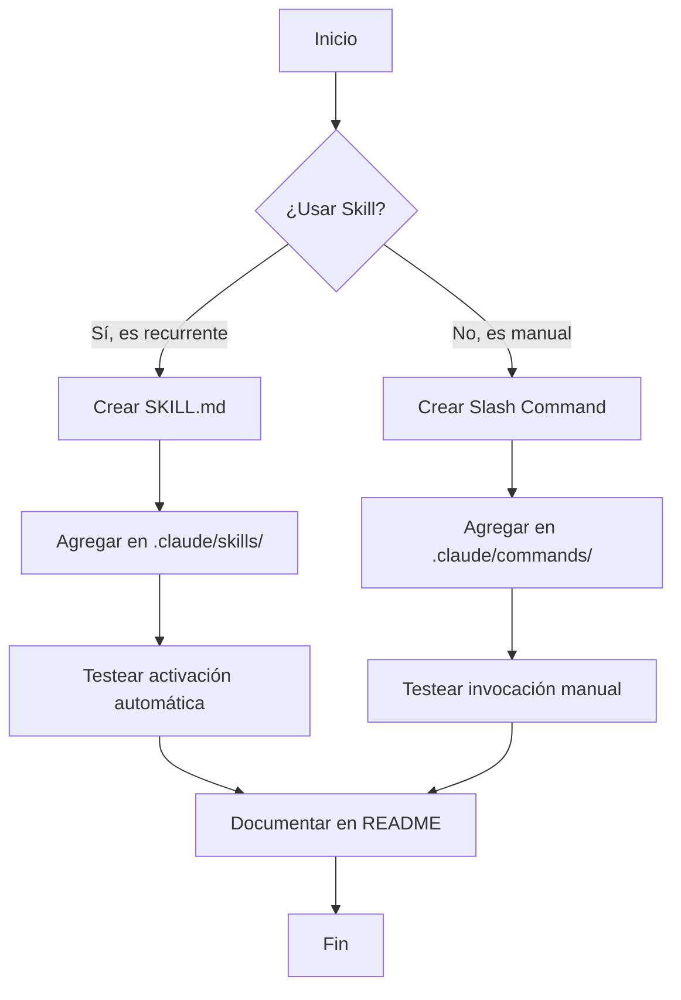
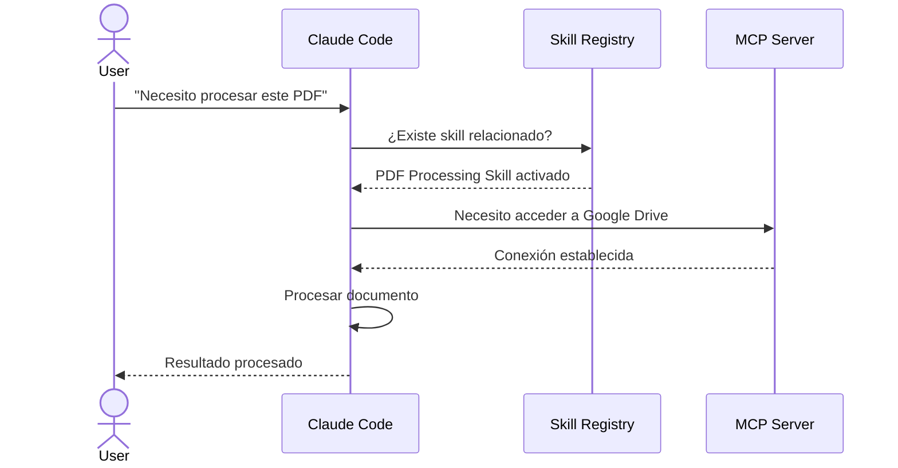
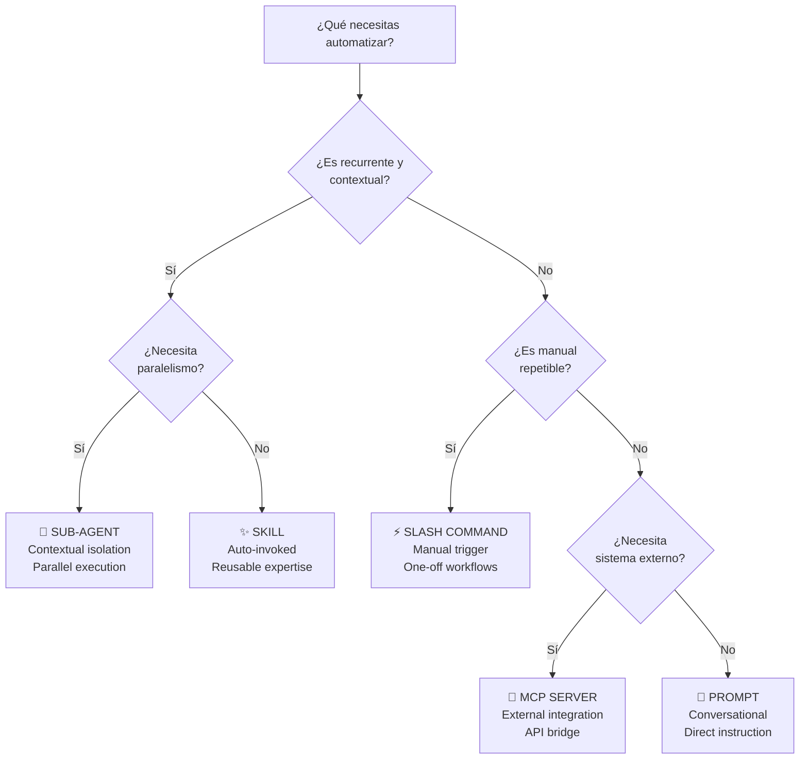
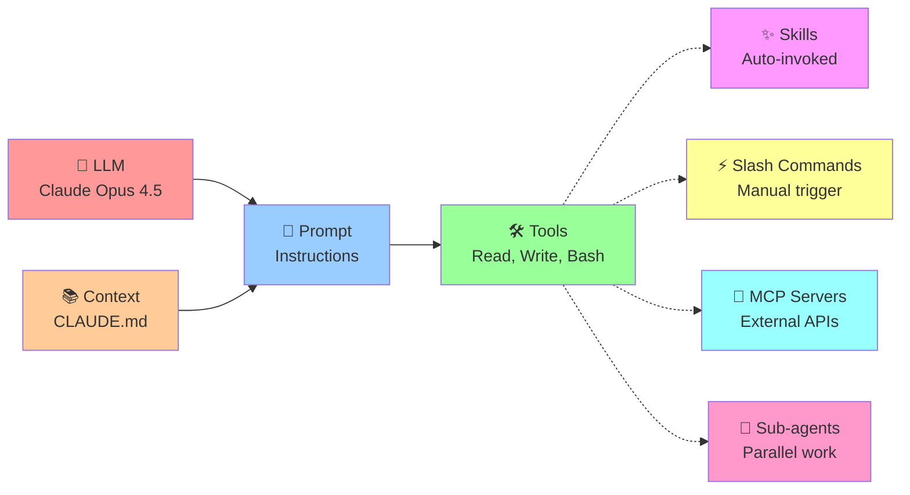
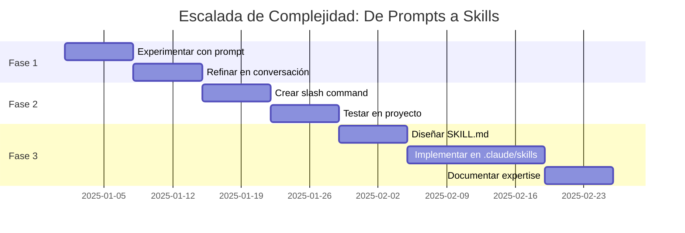
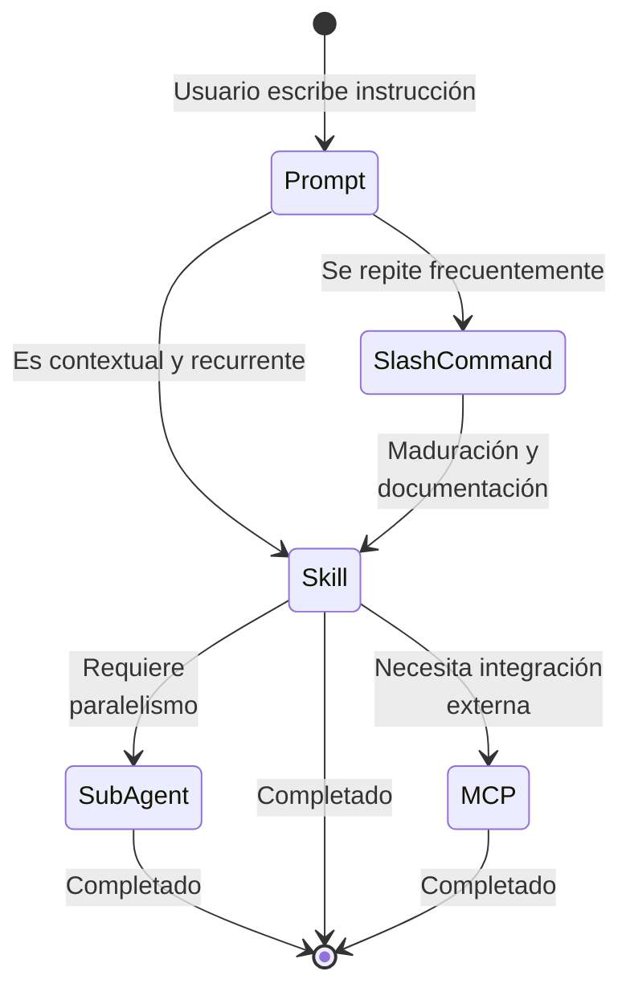
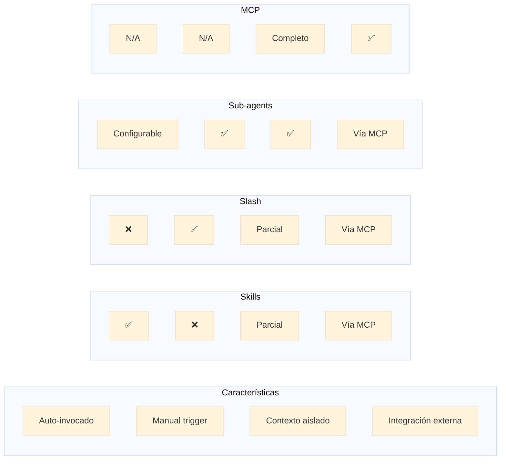

# Test: Soporte de Diagramas Mermaid en Docusaurus

Este documento prueba si Docusaurus soporta Mermaid de forma nativa. Los siguientes diagramas deberían renderizarse correctamente si la configuración es adecuada.

## 1. Flowchart (Diagrama de Flujo)



## 2. Secuencia (Diagrama de Secuencia)



## 3. Árbol de Decisión - Cuándo usar cada mecanismo



## 4. Diagrama de Componentes - Arquitectura de Claude Code



## 5. Gráfico de Gantt - Timeline de Escalada



## 6. Estado de Clases (State Diagram)



## 7. Gráfico de Barras - Comparativa de Características



## Instrucciones para Testear

Para ver si estos diagramas se renderizan correctamente:

```bash
# 1. Retorna a la rama
git checkout feature/test-mermaid-diagrams

# 2. Inicia servidor de desarrollo
bun start

# 3. Abre en navegador
# http://localhost:3000/docs/test/mermaid-diagrams-test

# 4. Verifica que los diagramas se rendericen
```

### Resultados Esperados

- ✅ Flowchart debería mostrarse como diagrama interactivo
- ✅ Secuencia debería mostrar interacciones
- ✅ Árboles de decisión deberían ser navegables
- ✅ Componentes con colores
- ✅ Gantt charts con timeline
- ✅ State diagrams con transiciones

### Si NO se renderizan:

1. **Verificar docusaurus.config.js**:
   ```js
   presets: [
     ['classic', {
       docs: {
         remarkPlugins: [require('mdx-mermaid')],
         // o
         rehypePlugins: [require('rehype-mermaid')],
       },
     }],
   ]
   ```

2. **Instalar dependencia si falta**:
   ```bash
   bun add mdx-mermaid
   # o
   bun add mermaid
   ```

3. **Alternativamente, usar bloques de código sin renderizado**:
   ```
   ````mermaid
   // diagrama aquí
   ````
   ```

---

**Fecha de test**: Diciembre 19, 2025
**Docusaurus versión**: 3.9.2
**Objetivo**: Validar soporte Mermaid para futuros artículos
